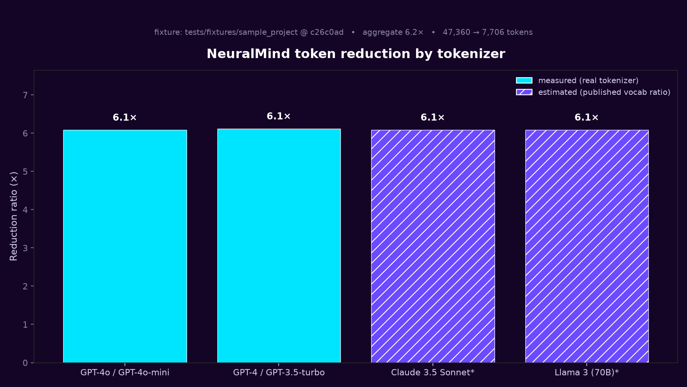

# 🧠 NeuralMind

[](https://pypi.org/project/neuralmind/)
[](https://opensource.org/licenses/MIT)
[](https://www.python.org/downloads/)
[](https://github.com/dfrostar/neuralmind/actions/workflows/ci-benchmark.yml)
[](#-security--compliance)
[](#-security--compliance)

**Persistent memory and context compression for AI coding agents.**

> Your AI coding agent learns your codebase the way a senior engineer would — what files go together, what you usually edit next, what patterns matter — and NeuralMind **compresses tool output before the model reads it**, so the agent spends tokens only on what matters. The memory persists across sessions and surfaces automatically. No MCP tool call required: NeuralMind writes a `SYNAPSE_MEMORY.md` file that Claude Code loads on every session start, so the agent boots with what it's learned about your code already in context.

> Works with Claude Code (including Claude Fable 5), Cursor, Cline, Continue, and any MCP-compatible agent. 100% local — your code never leaves your machine. The more capable the model, the more every saved token is worth, so context compression and persistent memory pay off more on a frontier model like Fable 5. (Side effect: ~5–10× cheaper agent sessions because the agent stops re-loading context it already understood. [Benchmarks below ↓](#-benchmarks).)

## Why NeuralMind — four benefits, each backed by an eval you can run

NeuralMind is more than token reduction. Every claim below ships with a
reproducible eval — run `python -m evals.public.run` yourself; the raw per-query
traces are committed.

| | Benefit | Measured result | Where it's measured |
|---|---|---|---|
| 💸 | **Cheaper context** | **100% gold-file recall at 38–85× fewer tokens** than pasting files — and beats `ripgrep` on *both* recall and cost | Public benchmark, **real OSS repos** (`requests`, `click`) |
| 🎯 | **Finds the *right* code, not just less of it** | **100% gold-file recall, MRR 0.96** — ranks the correct file at the top; beats the incumbent `codebase-memory-mcp` on retrieval ranking (0.96 vs 0.23) | Same public benchmark, **real repos** |
| 🧠 | **Learns how you work** | A Hebbian *synapse* layer that learns co-edited files lifts top-k retrieval hit-rate **+11.7 points (71.7%→83.3%)**, **budget-neutral** (no extra tokens) | Synapse A/B eval (reference fixture) |
| 🔬 | **Better-grounded answers** | At a *matched* token budget, its context carries more of the gold facts than naive truncation: **faithfulness +0.143, grounding 1.00** | Faithfulness/parity gate (reference fixture) |

*Honest scope:* the **cost** and **accuracy** rows run on real, pinned OSS repos
(fully reproducible — [methodology](docs/benchmarks/public.md)); the **learning**
and **grounding** rows are measured in committed A/Bs on the bundled reference
fixture, so they're real but smaller-scope. We report where NeuralMind *doesn't*
win too — a well-tuned vector RAG ties it on pure findability and is cheaper on
raw tokens; that's in the benchmark table.


> **🆕 New in v0.39.0** — **`neuralmind probe` now tests real NL→code retrieval.** The label-free `probe` self-test now queries each symbol by its **docstring/intent** (the `rationale` text NeuralMind already stores, e.g. *"Raised when the exp claim is in the past"*) instead of its name. Because that text doesn't contain the symbol name, retrieving the right code from it is a genuine **natural-language → code** test — not the string-match near-tautology the name-based version was (which read ~0.95 MRR on any healthy index and mostly flagged name collisions). Undocumented symbols fall back to a humanized name, and the report **discloses the rationale-vs-name split** so a weak run can't pose as a strong one. Hardened from review: code-only retrieval (`file_type="code"` instead of over-fetch-and-filter), an `index_size` that counts only code nodes, `--k ≥ 1` / `--sample-size ≥ 0` validation, no silently-swallowed backend errors, and `ks` honored for API callers. [Release notes](RELEASE_NOTES_v0.39.0.md)
>
> **v0.38.0** — **Hybrid search, explicit feedback, and CI auto-index.** Three retrieval-quality improvements in one release: **(1) BM25 hybrid search** — a code-aware keyword index (camelCase-split, snake_case-split) is built alongside the vector store and merged via **Reciprocal Rank Fusion** at query time, so "UserService" queries score exact-name matches first, not just semantically similar nodes — budget-neutral, toggle off with `NEURALMIND_BM25=0`. **(2) `neuralmind_feedback` MCP tool** — explicit positive/negative signal on a retrieved node that fires immediately: positive reinforces co-activation (same Hebbian update as natural co-editing, but instant); negative applies a targeted decay tick to all edges for that node (LTP-protected edges never fully removed by a single signal). **(3) CI auto-index GitHub Action** (`.github/workflows/neuralmind-autoindex.yml`) — auto-builds the index on every push to main, caches `.neuralmind/`, and commits the updated team memory snapshot so teammates always inherit fresh synapse intuition on their next session. No secrets needed — 100% local. [Release notes](RELEASE_NOTES_v0.38.0.md)
>
> **v0.37.0** — **Multi-language: PHP.** The built-in **tree-sitter** backend now indexes **PHP** (`.php`) out of the box — `neuralmind build .` works standalone on a PHP project, no graphify. `class`/`interface`/`trait`/`enum` become type nodes; methods/top-level functions become function nodes; properties (`$` stripped from the label), class constants, and enum cases become symbol nodes; `extends`/`implements` resolve to **`inherits`** edges; `use` namespace imports resolve to **`imports_from`** edges (by class name, exactly like Java imports); and `/** */` doc comments feed the **`rationale`** layer. That takes the bundled backend to **ten languages — Python, TypeScript, Go, Rust, Java, C, C++, C#, Ruby, and PHP** — behind the same `_SUFFIX_LANG` → `_EXTRACTORS` seam, proven at parity by the CI gate (**54/54 symbols, 100% structural coverage, zero dangling edges**), and **completing the C#/Ruby/PHP breadth tier**. Calls are best-effort and disclosed honestly (no `$obj->method` receiver-type resolution; `require`/`include` path imports aren't modelled — `use` is the edge source; trait-`use`-inside-a-class-body isn't modelled as inheritance). [Release notes](RELEASE_NOTES_v0.37.0.md)
>
> **v0.36.0** — **Multi-language: Ruby.** The built-in **tree-sitter** backend now indexes **Ruby** (`.rb`) out of the box — `neuralmind build .` works standalone on a Ruby project, no graphify. `class`/`module` become type nodes; `def`/`def self.` methods become function nodes; constant assignments (e.g. `ATTEMPTS = 3`) become symbol nodes; `class Foo < Bar` resolves to **`inherits`** edges; `require_relative` resolves to **`imports_from`** edges (relative-path resolved); and `#` doc comments feed the **`rationale`** layer. That takes the bundled backend to **nine languages — Python, TypeScript, Go, Rust, Java, C, C++, C#, and Ruby** — behind the same `_SUFFIX_LANG` → `_EXTRACTORS` seam, proven at parity by the CI gate (**46/46 symbols, 100% structural coverage, zero dangling edges**). Ruby is dynamic, so calls are best-effort and disclosed honestly (no receiver-type resolution; mixins via `include`/`extend` aren't modelled as inheritance; `attr_accessor` accessors/ivars aren't emitted as fields — constants are the symbol layer). [Release notes](RELEASE_NOTES_v0.36.0.md)
>
> **v0.35.0** — **Multi-language: C#.** The built-in **tree-sitter** backend now indexes **C#** (`.cs`) out of the box — `neuralmind build .` works standalone on a C# project, no graphify. `class`/`interface`/`struct`/`record`/`enum` become type nodes; methods/constructors become function nodes; fields, properties, and enum members become symbol nodes; `base_list` resolves to **`inherits`** edges; `using` directives resolve to **`imports_from`** edges; and `///` doc comments feed the **`rationale`** layer. That takes the bundled backend to **eight languages — Python, TypeScript, Go, Rust, Java, C, C++, and C#** — behind the same `_SUFFIX_LANG` → `_EXTRACTORS` seam, proven at parity by the CI gate (**52/52 symbols, 100% structural coverage, zero dangling edges**). C# maps almost 1:1 onto the proven Java extractor, so it rides a proven shape at the smallest risk. [Release notes](RELEASE_NOTES_v0.35.0.md)
>
> **v0.34.0** — **Answerability, not just findability.** Gold-file recall measures whether the *right file* lands in the window — **locating**, not **answering**. The new opt-in **answerability arm** (`python -m evals.public.run --judge`) closes that gap honestly: for each query it takes **the real context each backend would put in the window** (whole files for `full-file`/`ripgrep`, retrieved chunks for `embedding-rag`, the compact L0–L3 assembly for `neuralmind`), asks a pinned model (`claude-opus-4-8`) to answer **using only that context** (it must say "insufficient context" otherwise), then a separate judge call grades the answer against the **same def-site gold anchor** on a 0–2 scale plus a `grounded` flag. **Why it's hard to dismiss:** same prompts + same pinned model for every backend (a low-recall window scores low instead of being papered over from prior knowledge); the answerer prompt, judge rubric, model id, and **every raw transcript** are committed under `bench/public/judge/` (re-score or swap the model yourself). **Off the deterministic path:** it needs `ANTHROPIC_API_KEY`, never runs in CI, and the recall table is **byte-identical** with or without `--judge`. Recall-at-N×-tokens stays the headline; this is a clearly-labeled *secondary* signal. [Release notes](RELEASE_NOTES_v0.34.0.md) · [methodology](docs/benchmarks/public.md)
>
> **v0.33.0** — **The competitor head-to-head, run for real.** The public benchmark's competitor row is no longer a scaffold — it's a **live, reproducible head-to-head vs. `codebase-memory-mcp` 0.8.1** (the obvious incumbent) on the **same** pinned repos, same questions, same objective def-site gold, scored by the same `quality.py` as every other backend. At matched retrieval depth (top-8), **NeuralMind hits 100% gold-file recall and ranks the right file far higher** (MRR **0.96 vs 0.23** on `requests`, **0.60 vs 0.50** on `click`) while the competitor surfaces the gold file only ~half the time — at an order of magnitude more read cost. **Honest framing:** this is **pure retrieval ranking** (no LLM agent loop on either side — same as how we test NeuralMind's own `search`); we used the competitor's **most-favorable** reproducible keyword mapping; and we cite the competitor's *published* LLM-agent numbers (~90% of an "Explorer" agent; C at 0.58) as-is rather than reproduce them. So the win is **on reproducible retrieval ranking**, not on their agent-driven published figures. Reproduce: `python -m evals.public.competitor` (off the default run; `pip install codebase-memory-mcp==0.8.1`, no API key). [Release notes](RELEASE_NOTES_v0.33.0.md) · [methodology](docs/benchmarks/public.md)
>
> **v0.32.0** — **Multi-language: C and C++.** The built-in **tree-sitter** backend now indexes **C** (`.c`/`.h`) and **C++** (`.cpp`/`.cc`/`.cxx` + `.hpp`/`.hh`/`.hxx`) out of the box — `neuralmind build .` works standalone on a C/C++ project, no graphify. Functions, `struct`/`union`/`enum` (+ fields and constants), typedefs, C++ `class`es with member methods/fields, and **namespace-qualified ids** become `code` nodes; `#include "local.h"` resolves to **`imports_from`** edges; C++ base classes become **`inherits`** edges; and `foo.h`/`foo.c` pair onto a shared module key so a declaration and its definition land in the same neighborhood. That takes the bundled backend to **seven languages — Python, TypeScript, Go, Rust, Java, C, and C++** — behind the same `SUPPORTED_SUFFIXES` seam, proven at parity by the CI gate (100% symbol coverage, zero dangling edges). **Honest scope:** macros aren't indexed as symbols, templates aren't specialized, and `#ifdef` isn't evaluated — we index the parseable code at full parity and disclose what's out (a competitor advertising 158 languages scored 0.58 on C; we index what we can serve). [Release notes](RELEASE_NOTES_v0.32.0.md)
>
> **v0.31.0** — **The honest public benchmark.** The "40–70× fewer tokens" claim ships with reproducible evidence built to survive hostile scrutiny: `neuralmind benchmark --public` clones **real, pinned OSS repos** (`requests`, `click`) and scores **cost _and_ correctness together** against strong baselines (full-file paste, ripgrep, a same-encoder vector RAG). Result: **100% gold-file recall** (objective def-site oracle, no LLM judge) at **38–85× fewer tokens** than pasting files, beating ripgrep on *both* recall and cost. Synapse injection OFF for a fixed reproducible number; forkable runner + raw data committed. [Release notes](RELEASE_NOTES_v0.31.0.md) · [methodology](docs/benchmarks/public.md)
>
> **v0.30.0** *(shipped within v0.31.0)* — **Team memory: your agents inherit each other's intuition.** NeuralMind's synapse layer learns *what code goes with what* from how you work; now a team can **commit** that learned signal so every teammate's agent **inherits it automatically**. `neuralmind memory publish` writes a committed `.neuralmind-team-memory.json`; on a teammate's next session/build it's imported **once** into the `shared` namespace (content-hash-gated, `shared`-only, off-switch `NEURALMIND_TEAM_MEMORY=0`, fail-open). A fresh `git clone` starts with the team's earned intuition — zero setup, 100% local, no source in the bundle. The differentiator a static code-index can't copy. [Release notes](RELEASE_NOTES_v0.30.0.md)
>
> **v0.29.0** — **ChromaDB-free by default.** On mainstream platforms (Linux, Apple Silicon, Windows x64), `pip install neuralmind` no longer pulls **ChromaDB** — the default is the ChromaDB-free **turbovec/ONNX** backend (byte-identical embeddings), removing ChromaDB's dependency tree and its recurring **CVE surface** from the default. The backend is **platform-gated by wheel availability**, so the install never breaks: platforms turbovec has no wheel for (Intel macOS, Windows ARM) auto-install ChromaDB as a transparent fallback. Retrieval is unchanged; a chroma-indexed repo **auto-reindexes once** into turbovec. Honest framing: *ChromaDB-tree-free*, not "smaller" — it trades ChromaDB's sprawl for one focused native dep (`onnxruntime`). [Release notes](RELEASE_NOTES_v0.29.0.md)
>
> **v0.28.0** — **Multi-language: Java.** The built-in **tree-sitter** backend indexes **Java** out of the box — classes, interfaces, enums, records, methods, constructors, fields, and enum constants become `code` nodes; `extends`/`implements` → **`inherits`**; `import` → **`imports_from`** (by FQN); Javadoc → the **`rationale`** layer. Five bundled languages (Python/TS/Go/Rust/Java). [Release notes](RELEASE_NOTES_v0.28.0.md)
>
> **v0.27.0** — **Multi-language: Rust.** The built-in **tree-sitter** backend indexes **Rust** out of the box — structs, enums, traits, `impl` blocks, fields, and free functions become `code` nodes; `impl Trait for Type` → **`inherits`**; `use` paths → **`imports_from`**; `///`/`//!` doc comments → the **`rationale`** layer; `target/` is skipped. [Release notes](RELEASE_NOTES_v0.27.0.md)
>
> **v0.26.0** — **the selector starts tuning itself.** Phases 1–2 of the self-improvement engine (issue #156): NeuralMind's memory logs query and wakeup events with a `session_id`, and an **opt-in tuner** (`NEURALMIND_SELECTOR_AUTOTUNE=1`) reads that signal back to adjust the selector's **L2 recall depth** from the **re-query rate**, persisted in the synapse store's `meta` table, with a **transition-margin dampener**. Off by default and byte-identical to v0.25.0 when unset (zero extra hot-path I/O); bounded to `[2, 6]` with single-step, windowed, fail-open moves. Inspect it with the read-only **`neuralmind self-improve status`**. [Release notes](RELEASE_NOTES_v0.26.0.md)
>
> **v0.25.0** — **one learning system: the synapse layer.** The old `learned_patterns` cooccurrence reranker is **removed**, and `neuralmind learn` is now an exit-0 deprecation no-op. The Hebbian **synapse layer** — which already learns continuously from queries, edits, and tool calls, and lets unused edges decay — is now NeuralMind's single learning signal. This is a removal, not a regression: a 2×2 A/B on the benchmark fixture showed the reranker moved top-k hit rate by **0.0 points** with synapses on or off (71.7% → 71.7% cold, 83.3% → 83.3% warm), while the synapse layer alone adds **+11.6 points**. The reranker was also runtime-inert on the warm path (the synapse re-sort discarded its order), needed the manual `neuralmind learn` step, and went stale between runs. **Warm-path behavior is unchanged** — recall is synapse-driven exactly as before; the only visible difference is the L3 output no longer prints `(+X.XX boost)` labels from the reranker (synapse labels stay). Scripts calling `neuralmind learn` keep working (exit 0); a stale `.neuralmind/learned_patterns.json` is ignored and can be deleted; `NeuralMind(enable_reranking=...)` is accepted and ignored. [Release notes](RELEASE_NOTES_v0.25.0.md)
>
> **v0.24.0** — **memory namespaces & branch isolation.** The learned synapse layer is now **namespace-aware**: `branch:<name>` / `personal` / `shared` / `ephemeral` memory live separately in the same store, so a feature-branch spike can't pollute what the agent learned about `main`. Recall stays smart by default — a **transparent merged view** weights the active branch at **1.0×**, your long-term `personal` memory at **0.8×**, and an imported `shared` team baseline at **0.5×** (published constants, attributed per-namespace in `query --trace`). New **`neuralmind memory {inspect,reset,export,import}`** shows contribution by namespace, clears exactly one namespace, and moves memory as **versioned JSON bundles** (the PRD 8 team-memory on-ramp). Existing learned memory migrates **in place, losslessly** into `personal` — single-transaction rebuild, rollback on any failure, proven by a no-data-loss test. [Release notes](RELEASE_NOTES_v0.24.0.md)
>
> **v0.23.0** — **versioned index contract (IR), retrieval-quality harness, debug traces, and a local daemon.** Four future-proofing foundations. **(PRD 1)** A canonical, **schema-versioned** intermediate representation of your code graph, validated on every build — a new **`neuralmind validate`** command checks the contract **without a vector backend**; the embedder still reads `graph.json` unchanged (the IR round-trips back identically), so retrieval is unaffected. **(PRD 2)** A new **`neuralmind benchmark --quality`** mode measures whether retrieval finds the *right* code — **precision@k / recall@k / MRR / answerability** over 30 golden queries across Python/TS/Go — and **fails CI on a regression**. **(PRD 3)** **`neuralmind query --trace`** shows *why* a result came back — per-layer candidates, cluster scoring with vector-vs-synapse attribution, and final hits. **(PRD 5)** An experimental **`neuralmind daemon`** holds project state warm so repeat `query`/`stats` skip cold backend init (auto-preferred when running, transparent direct-mode fallback). [Release notes](RELEASE_NOTES_v0.23.0.md)
>
> **v0.22.0** — **turbovec becomes the default (when available).** `import neuralmind` no longer requires ChromaDB, and the default backend is now **`auto`**: prefer the ChromaDB-free `turbovec` path when its deps are installed, else fall back to chroma. Safe by construction — a plain `pip install neuralmind` is unchanged; only installs with the `[turbovec]` extra flip, with a **one-time auto-reindex** (the old ChromaDB index is left as a fallback, nothing deleted). `neuralmind doctor` now shows the resolved backend. The staged middle step toward retiring ChromaDB. [Release notes](RELEASE_NOTES_v0.22.0.md)
>
> **v0.21.0** — **ChromaDB-free retrieval.** NeuralMind can now embed *and* search with **zero ChromaDB**: the opt-in `turbovec` backend pairs Google Research's **TurboQuant** compressed index (8–16× smaller vectors) with a bundled `OnnxMiniLMEmbedder` that produces vectors **byte-identical** to ChromaDB's (`all-MiniLM-L6-v2` on just onnxruntime + tokenizers). At/above retrieval parity on the gold set (fact-recall 0.744→0.800). Enable with `backend: turbovec` in `neuralmind-backend.yaml`. This retires the dependency behind the recurring **CVE-2026-45829** advisory. [Release notes](RELEASE_NOTES_v0.21.0.md)
>
> **v0.20.0** — **Measure the onboarding lift.** `neuralmind eval --onboarding` turns NeuralMind's headline differentiator into a number: does an agent that inherits a **committed team memory** retrieve better on its first queries than a cold agent with none? The headline is the **top-k module hit-rate lift** (a deterministic +6.5 points on the reference fixture), with fact-recall + grounding as honest secondaries; **budget-neutral by design**, gated in CI at lift ≥ 0. [Release notes](RELEASE_NOTES_v0.20.0.md)
>
> **v0.19.0** — **One-command MCP setup.** `neuralmind install-mcp --all` auto-detects your installed agents — **Claude Code, Cursor, Cline, Claude Desktop** — and registers NeuralMind's MCP server with each (non-destructive merge, idempotent). The agent then onboards onto your codebase through NeuralMind's tools instead of grepping cold. Distribution is half the moat; the learned synapse layer (usage memory) is the other half. [Release notes](RELEASE_NOTES_v0.19.0.md)
>
> **v0.18.0** — **Incremental updates.** Re-index just the file you edited, not the whole repo: `neuralmind watch --reindex` re-parses each changed file and re-embeds **only its nodes** (unchanged files stay byte-for-byte identical, so the embedder skips them). Your index stays fresh as you type. [Release notes](RELEASE_NOTES_v0.18.0.md)
>
> **v0.17.0** — **Optional SCIP precision.** Set `NEURALMIND_PRECISION=1` with a **SCIP** index (`scip-python`/`scip-typescript`/`scip-go`) and NeuralMind folds in **compiler-accurate** `calls`/`inherits` edges, replacing the heuristic ones for covered files. Off by default, dependency-free, proven by a precision check in the CI gate. [Release notes](RELEASE_NOTES_v0.17.0.md)
>
> **v0.16.0** — **Multi-language: TypeScript + Go.** The built-in **tree-sitter** backend now indexes **Python, TypeScript, and Go** out of the box — `neuralmind build .` works standalone on a TS or Go repo, no graphify. Proven at parity per language by the CI gate (100% symbol coverage vs graphify). [Release notes](RELEASE_NOTES_v0.16.0.md)
>
> **v0.15.0** — **No graphify needed.** A built-in **tree-sitter** graph backend, so `pip install neuralmind && neuralmind build .` *just works* — no second, external tool. graphify still takes priority where present. Proven at parity by a CI gate (reduction + faithfulness within tolerance). [Release notes](RELEASE_NOTES_v0.15.0.md)
>
> **v0.14.0** — **Measure faithfulness.** A new contributor/CI command — `neuralmind eval` — turns *"does the memory actually help?"* into a number: it scores whether NeuralMind's selected context contains more of the facts a correct answer needs than a naive baseline **at the same token budget** (a faithfulness delta, plus grounding and contradiction checks). 100% local by default; the LLM-as-judge is opt-in. [Release notes](RELEASE_NOTES_v0.14.0.md)
>
> **v0.13.0** — **Measurement foundation.** The offline faithfulness dataset + expected-fact-recall scorer and polyglot (TypeScript + Go) retrieval fixtures that `neuralmind eval` is built on. [Release notes](RELEASE_NOTES_v0.13.0.md)
>
> **v0.12.0** — **Install Doctor.** One command — `neuralmind doctor` — inspects your setup (code graph, semantic index, synapse memory, MCP server, Claude Code hooks, query-memory consent) and prints each piece with a status and the exact command to fix it. Exits non-zero on a real failure so you can gate CI or an agent's setup step on it; `--json` gives a stable machine-readable snapshot. [Release notes](RELEASE_NOTES_v0.12.0.md)
>
> **v0.11.0** — **Directional Synapses.** The brain-like layer now learns *what comes next*, not just *what goes together*. A new `synapse_transitions` table records ordered `(from_node, to_node)` observations every time the watcher flushes a batch, so the agent can ask `neuralmind next <file>` (or call the `neuralmind_next_likely` MCP tool) and get a probability distribution over what's typically edited after that file. Additive — the existing undirected synapse graph keeps doing its job. [Release notes](RELEASE_NOTES_v0.11.0.md)
>
> **v0.9.0** — **Enterprise-Ready.** GHCR auto-built multi-platform container image (`docker pull ghcr.io/dfrostar/neuralmind:latest`), CycloneDX SBOM attached to every release, [air-gapped install walkthrough](docs/use-cases/air-gapped.md), and a [compliance one-pager](docs/COMPLIANCE-SUMMARY.md) consolidating NIST AI RMF + SOC 2 + GDPR claims. [Release notes](RELEASE_NOTES_v0.9.0.md)
>
> **v0.8.0** — **Always-On.** `neuralmind watch` + `neuralmind serve` run as first-class services with [committed systemd + launchd templates](docs/use-cases/always-on.md) + a Windows Task Scheduler walkthrough in the [Scheduling Guide](docs/wiki/Scheduling-Guide.md) + a `/healthz` endpoint for Docker HEALTHCHECK and systemd ExecStartPost probes. [Release notes](RELEASE_NOTES_v0.8.0.md)
>
> **v0.7.0** — **Install anywhere.** Five install paths now in the README: `pip`, `pipx`, `uv`, Docker, and source. Same package every path; smoke-test verified. [Release notes](RELEASE_NOTES_v0.7.0.md) · [Install matrix ↓](#install--pick-your-path)
>
> **v0.6.0** — Obsidian-style graph view with a **live activity feed**. `neuralmind serve` streams synapse + file events to the canvas in real time, so you can *watch the brain learning your codebase*. [Release notes](RELEASE_NOTES_v0.6.0.md) · [Graph view section ↓](#-graph-view-neuralmind-serve)

> **🌐 [Visit the landing page](https://dfrostar.github.io/neuralmind/) • 📖 [Read the About page](https://dfrostar.github.io/neuralmind/about.html) • ⚖️ Not affiliated with NeuralMind.ai**

---

## 🧠 What changes when an agent has memory

Three concrete behaviors appear once the synapse layer has watched a few coding sessions on your project. None of them require the agent to call extra tools — the memory primes the model on session start and surfaces predictions automatically.

| Without NeuralMind | With NeuralMind |
|---|---|
| Every session, the agent starts cold. You re-explain your auth flow, your billing module, your naming convention. | Session starts with `SYNAPSE_MEMORY.md` already in context: *"strongest associations: `middleware.py` ↔ `handlers.py` ↔ `session.py` — auth flow. Hub: `middleware.py`."* The agent boots knowing the shape of your code. |
| Agent finishes editing `payment_service.py`, asks "anything else?" | Agent: *"after `payment_service.py` you usually update `webhook_handler.py` (45%) and the test file (28%) — want me to do those too?"* Learned from your edit history, no manual hint needed. *(v0.11.0+)* |
| `npm test` floods the conversation with 800 lines. Agent re-reads 50K tokens. | Hook auto-summarizes Bash output to errors + repeated-line patterns + last 3 lines. `neuralmind last` recovers the raw cache when needed. *(v0.10.0+)* |

The brain layer learns continuously from how you actually work — file co-edits via a watcher daemon, query intent from MCP calls, tool-use patterns from PostToolUse hooks. Decays unused associations like a real brain so stale knowledge doesn't crowd out current patterns.

This is not "another RAG tool." It's the memory layer that everything else assumes the agent already has.

---

## ⚡ 30-second proof — see the memory work

The clearest evidence the memory is working is the measurable side effect: the agent stops re-loading context it already understood. Reproduce it on a freshly cloned checkout:

```bash
git clone https://github.com/dfrostar/neuralmind && cd neuralmind
bash scripts/demo.sh
```

The script creates an isolated venv, installs the deps, builds the index for the bundled fixture (`tests/fixtures/sample_project/`), and runs three real questions. Each question loads only the relevant code instead of the whole repo — exactly the kind of context-economy a senior engineer applies without thinking. Output looks like:

```
  Q: How does authentication work in this codebase?
     naive = 4,736 tok   neuralmind =  829 tok   reduction =   5.7×
  Q: What are the main API endpoints?
     naive = 4,736 tok   neuralmind =  923 tok   reduction =   5.1×
  Q: Explain the billing flow from a user perspective.
     naive = 4,736 tok   neuralmind =  826 tok   reduction =   5.7×

  Average reduction:   5.5×  across 3 queries
  Avg context size:    859 tokens  (vs 4,736 naive)
  Est. monthly saved:  ~$34.89  @ 100 queries/day on Claude 3.5 Sonnet
  Wall time:           0.85s
```

The fixture is intentionally small (~500 lines) — it catches regressions in CI. Real repos consistently hit **40–70×** on the same pipeline ([benchmarks](#-benchmarks) · [community submissions](#community-benchmarks) · [interactive dashboard](https://dfrostar.github.io/neuralmind/benchmarks/)). Once the demo convinces you, run it on your own code:

```bash
pip install neuralmind          # built-in tree-sitter backend — no graphify needed (v0.15.0+)
cd /path/to/your-repo
neuralmind build .
neuralmind benchmark . --contribute
```

> Prefer graphify's richer graph? Install it and it takes priority automatically:
> `pip install neuralmind graphifyy && graphify update . && neuralmind build .`

---

## 📊 The fact-based case

Two docs you should read before forming an opinion. Both are linked from this section so you can pick what you need:

- **[docs/BUSINESS-CASE.md](docs/BUSINESS-CASE.md)** — the compelling pitch, with provable numbers. Every claim is a single command away from being verified on your own code. ROI math with assumptions you can change. Three concrete scenarios. Read this if you're evaluating whether to bring NeuralMind to your team.
- **[docs/HONEST-ASSESSMENT.md](docs/HONEST-ASSESSMENT.md)** — the skeptic's companion. When NeuralMind isn't worth installing. What "40–70×" actually means (and doesn't). Where the community-benchmark sample is too small to extrapolate. Read this if you want to know what could go wrong before adopting.

The headline you can stand on: **retrieval reduction is measured in CI on every commit** (open any closed PR in the [PR list](https://github.com/dfrostar/neuralmind/pulls?q=is%3Apr+is%3Aclosed) — each one has a sticky benchmark comment with current numbers) and **reproduces in 30 seconds on a fresh clone** via `bash scripts/demo.sh`. Real-world repos have submitted **46–66×** but n=2 — your number comes from `neuralmind benchmark . --contribute` on your code.

---

## 🔒 Security & Compliance

**For enterprises and regulated industries:**

- **100% Local Processing** – Your code never leaves your machine. All embeddings are generated and stored locally (the default turbovec/ONNX backend; ChromaDB optional).
- **No External APIs** – NeuralMind runs completely offline. No cloud services, no telemetry, no data exfiltration.
- **Explainable AI** – Every context decision is auditable. Know exactly which code was retrieved (Extracted) vs. inferred by the model.
- **Open-Source & MIT Licensed** – Full transparency. No hidden clauses, no vendor lock-in. Audit the code yourself.
- **GDPR/HIPAA-Friendly** – Process sensitive code without compliance concerns. All data stays under your control.

**For CTOs & Security Teams:**
- ✅ Zero external dependencies for code storage
- ✅ Runs behind your firewall or on-premise
- ✅ No collection of usage metrics or code patterns
- ✅ Predictable, reproducible results (not a black box)
- ✅ Works with proprietary and sensitive code

[See full security policy](SECURITY.md)

---

## 📌 For AI Coding Agents

> **If you are Claude Code, Codex, Cursor, Cline, or any AI agent with NeuralMind installed, start here.**

### Check if NeuralMind is active

```bash
neuralmind stats .
```

Expected output when ready:
```
Project: your-project
Built: True
Nodes: 241
```

If `Built: False`, run `neuralmind build .` first (the built-in backend generates the graph automatically; no graphify needed).

---

### Startup workflow

**Every new session, do this first:**

```bash
neuralmind wakeup .
```

Or via MCP:
```
neuralmind_wakeup(project_path=".")
```

This returns ~365–600 tokens of structured project context:

- Project name and description (from `CLAUDE.md`, `mempalace.yaml`, or `README.md` first line)
- How many code entities and clusters are indexed
- Architecture overview: top 10 code clusters with their entity types and sample names
- Sections from `graphify-out/GRAPH_REPORT.md` if present

**Use this output as your orientation before writing any code.** It replaces reading the entire repository.

---

### Decision tree — which tool to call

```
Need to understand the project?
  └─► neuralmind wakeup .               (MCP: neuralmind_wakeup)      ~400 tokens

Answering a specific code question?
  └─► neuralmind query . "question"     (MCP: neuralmind_query)       ~800–1100 tokens

About to open a source file?
  └─► neuralmind skeleton <file>        (MCP: neuralmind_skeleton)    ~5–15× cheaper than Read
      → Only fall back to Read when you need the actual implementation body
      → Use NEURALMIND_BYPASS=1 when you truly need raw source

Answering a complex, multi-part question?
  └─► neuralmind recursive-query . "q"  (MCP: neuralmind_recursive_query)  decomposes + synthesizes

Question about reference documents (PDFs, legal, clinical)?
  └─► neuralmind query-docs . "q"       (MCP: neuralmind_query_docs)       searches doc index only

Searching for a specific function/class/entity?
  └─► neuralmind search . "term"        (MCP: neuralmind_search)      ranked by semantic similarity

Made code changes and need to update the index?
  └─► neuralmind build .                (MCP: neuralmind_build)       incremental — only re-embeds changed nodes
```

---

### Understanding the output

#### `wakeup` / `query` output format

```
## Project: myapp

Full-stack web app for task management. Uses React 18, Node.js, and PostgreSQL.

Knowledge Graph: 241 entities, 23 clusters
Type: Code repository with semantic indexing

## Architecture Overview

### Code Clusters
- Cluster 5 (45 entities): function — authenticate_user, hash_password, verify_token
- Cluster 12 (23 entities): class — UserController, AuthMiddleware, SessionStore
- Cluster 3 (18 entities): function — createTask, updateTask, deleteTask
...

## Relevant Code Areas        ← query only; absent from wakeup
### Cluster 5 (relevance: 1.73)
Contains: function entities
- authenticate_user (code) — auth.py
- verify_token (code) — auth.py

## Search Results             ← query only
- AuthMiddleware (score: 0.91) — middleware.py
- jwt_handler (score: 0.85) — auth/jwt.py

---
Tokens: 847 | 59.0x reduction | Layers: L0, L1, L2, L3 | Communities: [5, 12]
```

**Layer meanings:**

| Layer | Name | Always loaded | Content |
|-------|------|--------------|---------|
| L0 | Identity | ✅ yes | Project name, description, graph size |
| L1 | Summary | ✅ yes | Architecture, top clusters, GRAPH_REPORT sections |
| L2 | On-demand | query only | Top 3 clusters most relevant to the query |
| L3 | Search | query only | Semantic search hits (up to 10) |

#### `skeleton` output format

```
# src/auth/handlers.py  (community 5, 8 functions)

## Functions
L12   authenticate_user   — Validates credentials and issues JWT
L45   verify_token        — Checks JWT signature and expiry
L78   refresh_token       — Issues new JWT from a valid refresh token
L102  logout              — Revokes refresh token in DB

## Call graph (within this file)
authenticate_user → verify_token, hash_password
refresh_token → verify_token

## Cross-file
verify_token imports_from → utils/jwt.py (high 0.95)
authenticate_user shares_data_with → models/user.py (high 0.91)

[Full source available: Read this file with NEURALMIND_BYPASS=1]
```

Use `skeleton` to understand what a file does, how its functions relate, and which other files it depends on — **without consuming tokens on the full source body**.

#### `search` output format

```
1. authenticate_user (function) - score: 0.92
   File: auth/handlers.py  Community: 5

2. AuthMiddleware (class) - score: 0.87
   File: auth/middleware.py  Community: 5

3. hash_password (function) - score: 0.81
   File: utils/crypto.py  Community: 5
```

---

### PostToolUse hooks — what happens automatically

If `neuralmind install-hooks` has been run for this project (check for `.claude/settings.json`), Claude Code automatically compresses tool outputs **before you see them**:

| Tool | What happens | Typical savings |
|------|-------------|----------------|
| **Read** | Raw source → graph skeleton (functions, rationales, call graph) | ~88% |
| **Bash** | Full output → error lines + warning lines + last 3 lines + summary | ~91% |
| **Grep** | Unlimited matches → capped at 25 + "N more hidden" pointer | varies |

**This is fully automatic — you do not need to call any extra tools.**

**Optional SessionStart selector tuning *(v0.26.0+)*.** If you set `NEURALMIND_SELECTOR_AUTOTUNE=1`, the `SessionStart` hook also runs the self-improvement tuner once per session (after the synapse decay tick), adjusting the L2 recall depth from how often you had to re-query — off by default, fail-open, and byte-identical to before when unset. Inspect it with `neuralmind self-improve status .`.

#### What the agent actually sees on a compressed Bash call *(v0.10.0+)*

After every Bash call, NeuralMind appends a content-aware footer so
the agent can tell at a glance *what was dropped* — not just how
many bytes:

```
[neuralmind: dropped 23 lines (12 info, 8 debug, 3 other);
 repeated: 5× 'Gamma API error 503'  ·  4298 B stdout total  ·
 `neuralmind last` for cached raw  ·  NEURALMIND_BYPASS=1 to disable]
```

This lets the agent judge whether the dropped middle was log noise
(safe to ignore) or a buried error (worth recovering). No second
query needed to find out.

#### Recovery without re-running *(v0.10.0+)*

Every compressed Bash call also stashes its raw stdout/stderr to
`<project>/.neuralmind/last_output.json` (single-slot, 2 MB cap,
atomic writes). Recover it with:

```bash
neuralmind last           # human-readable raw output
neuralmind last --json    # full payload (ts, command, exit, stdout, stderr)
```

This turns `NEURALMIND_BYPASS=1` from a re-run-from-scratch cost
into a free lookup — meaningful on `npm test` (~28s),
non-deterministic API calls, or any destructive command that can't
be re-run safely.

To bypass compression on a future command (the new full output goes
into the cache instead of being summarized):
```bash
NEURALMIND_BYPASS=1 <your command>
```

To disable the recovery cache entirely:
```bash
export NEURALMIND_OUTPUT_CACHE=0
```

---

### Predict the next file *(v0.11.0+)*

After `neuralmind watch` has been running for a handful of sessions, the
synapse layer learns directional edit patterns — not just *what files
go together* but *what file usually follows what*. Ask it directly:

```bash
$ neuralmind next . src/auth/handlers.py
After src/auth/handlers.py:
   45.2%  tests/test_auth.py
   28.4%  src/auth/middleware.py
   12.1%  docs/auth.md
    8.3%  src/auth/__init__.py
    6.0%  src/main.py
```

The same prediction is available three ways depending on who's asking:

| Surface | How an agent reaches it | Where it's read |
|---------|------------------------|-----------------|
| **MCP tool** `neuralmind_next_likely` | Cursor / Cline / Continue / any MCP client | After editing a file, prefetch the likely next one |
| **CLI** `neuralmind next <dir> <file>` | Shell, scripts, status lines | Quick lookup or piping into a fzf picker |
| **Auto-memory** `SYNAPSE_MEMORY.md` | Claude Code (loads on session start, no user action) | "What typically comes next" section primes the model with the top transitions before any tool call |

**Why this matters for agents:** the auto-memory section is the single
highest-leverage surface — Claude Code sees `SYNAPSE_MEMORY.md` on
every session start without anyone asking. An agent priming on
"after `src/auth/handlers.py`, the human usually opens
`tests/test_auth.py`" can proactively offer to update the test, rather
than waiting to be asked. Zero user prompts; the prediction is just
in context.

The transition signal needs a long observation window to converge
(N files edited together yield only N-1 ordered pairs), so running
the watcher as a service via the [always-on guide](docs/use-cases/always-on.md)
shortens time-to-useful-predictions from weeks to days.

---

### Branch-isolated memory *(v0.24.0+)*

Every learned association now carries a **namespace**. On `main` nothing
changes — your memory is the `personal` namespace, read at full weight. The
moment you `git checkout -b feature-x`, new activations land in
`branch:feature-x`, and recall reads a **merged view**: branch-local context
at 1.0×, long-term `personal` at 0.8×, an imported `shared` team baseline at
0.5× (explicit constants — `query --trace` attributes every boost to the
namespace that drove it). Session scratch goes to `ephemeral`, which decays
fast and is cleared at the next SessionStart.

```bash
$ neuralmind memory inspect .
Synapse memory — .neuralmind/synapses.db
Active namespace: branch:feature-x  (schema v1)
Namespace                  Edges    Weight  Transitions   Nodes
branch:feature-x              34      6.20           12      28
personal                     412     88.71          120     310
shared                        96     31.40           41       0

$ neuralmind memory reset . --namespace branch:feature-x   # branch merged? drop its memory
$ neuralmind memory export . --namespace personal -o team-baseline.json
$ neuralmind memory import team-baseline.json --namespace shared   # teammate's machine
```

Existing learned memory migrates **in place and losslessly** into
`personal` on first open (single transaction, rollback on any failure).
See the [branch-isolated memory walkthrough](docs/use-cases/branch-isolated-memory.md)
and [Release Notes v0.24.0](RELEASE_NOTES_v0.24.0.md).

---

### After making code changes

The index does **not** auto-update unless a git post-commit hook was installed with `neuralmind init-hook .`. After significant code changes, rebuild manually:

```bash
neuralmind build .          # incremental — only re-embeds changed nodes
neuralmind build . --force  # full rebuild — re-embeds everything
```

---

### MCP tool quick reference

| Tool | When to call | Required params | Returns |
|------|-------------|----------------|---------|
| `neuralmind_wakeup` | Session start | `project_path` | L0+L1 context string, token count |
| `neuralmind_query` | Code question | `project_path`, `question` | L0–L3 context string, token count, reduction ratio |
| `neuralmind_search` | Find entity | `project_path`, `query` | List of nodes with scores, file paths |
| `neuralmind_skeleton` | Explore file | `project_path`, `file_path` | Functions + rationales + call graph + cross-file edges |
| `neuralmind_recursive_query` | Complex question | `project_path`, `question` | Synthesized answer, sub-queries, gaps, sources |
| `neuralmind_query_docs` | Reference docs | `project_path`, `question` | Relevant doc chunks with source files and relevance scores |
| `neuralmind_stats` | Check status | `project_path` | Built status, node count, community count |
| `neuralmind_build` | Rebuild index | `project_path` | Build stats dict |
| `neuralmind_benchmark` | Measure savings | `project_path` | Per-query token counts and reduction ratios |

---

## ⚡ Two-phase optimization

```
┌─────────────────────────────────────────────────────────────┐
│ Phase 1: Retrieval — what to fetch                          │
│   neuralmind wakeup .    →  ~365 tokens (vs 50K raw)        │
│   neuralmind query "?"   →  ~800 tokens (vs 2,700 raw)      │
│   neuralmind_skeleton    →  graph-backed file view          │
├─────────────────────────────────────────────────────────────┤
│ Phase 2: Consumption — what the agent actually sees         │
│   PostToolUse hooks compress Read/Bash/Grep output          │
│   File reads → graph skeleton (~88% reduction)              │
│   Bash output → errors + summary (~91% reduction)           │
│   Search results → capped at 25 matches                     │
└─────────────────────────────────────────────────────────────┘
```

**Combined effect: 5–10× total reduction vs baseline Claude Code.**

---

## 🎯 The Problem

```
You: "How does authentication work in my codebase?"

❌ Traditional: Load entire codebase → 50,000 tokens → $0.15–$3.75/query
✅ NeuralMind: Smart context → 766 tokens → $0.002–$0.06/query
```

## 💰 Realistic savings

The dollar figures depend on **your** workload. Run `neuralmind benchmark . --contribute` to get numbers for your codebase and query volume. Order-of-magnitude expectations:

| You today | NeuralMind likely saves | Setup pays back in |
|---|---|---|
| <$50/mo on LLM, small repo | $5–15/mo | months — probably skip |
| $50–500/mo, 10K+ line repo | $20–200/mo | days |
| $500–5,000/mo team workload | hundreds–thousands/mo | hours |
| Already using prompt caching + long context | smaller marginal win | measure first |

These are **directional**. The [Honest Assessment](docs/HONEST-ASSESSMENT.md) explains why retrieval-token reduction (40–70×) ≠ end-to-end cost reduction (3–10× typical), and when NeuralMind is and isn't worth installing.

---

## ✅ Does it work on *your* code? Prove it in 5 minutes.

> NeuralMind [benchmarks itself in CI](#-benchmarks) on every PR. But your codebase isn't our fixture. The only way to know what it does for **you** is to measure it on **your code**.

```bash
pip install neuralmind        # built-in tree-sitter backend — no graphify needed (v0.15.0+)
cd /path/to/your-project
neuralmind build .
neuralmind benchmark .
```

You'll get back your actual reduction ratio and per-query token count — typically **30–80× on real repos**. No telemetry, nothing uploaded, nothing committed. If the numbers don't justify it, `pip uninstall neuralmind` and move on — 5 minutes lost.

**Want the dollar figure for your team?**

```bash
neuralmind benchmark . --contribute
```

That flag produces a ready-to-share JSON blob with your project's numbers, the exact command that produced them, and an estimated monthly savings at your query volume. Paste it into Slack, a design doc, a PR — or optionally [contribute it to the public leaderboard](#community-benchmarks).

**Full walkthrough:** [Does NeuralMind work on *your* codebase?](docs/use-cases/benchmark-your-repo.md)

---

## 🚨 When do I reach for NeuralMind?

Two ways to decide: start with what's annoying you (**symptoms**), or start with what you're trying to achieve (**goals**).

### Symptoms — "This is happening to me"

| What you notice | Reach for | Why it fixes it |
|---|---|---|
| Agent starts every session not knowing my codebase | `neuralmind install-hooks .` + `neuralmind watch .` | `SYNAPSE_MEMORY.md` auto-loads on session start with learned associations + transitions |
| I keep telling the agent "after you edit X, also update Y" | `neuralmind watch .` *(v0.11.0+)* | Directional transitions learn the pattern; agent proactively suggests the follow-up |
| Multi-agent setup (Claude Code + Cursor + Cline) — each one has its own context | NeuralMind MCP server | Shared synapse store; learning from one agent benefits the others |
| Claude Code hits context limits mid-task | `neuralmind install-hooks .` | Auto-compresses Read/Bash/Grep **before** the agent sees them (~88–91%) |
| My monthly LLM bill is climbing | `neuralmind query` + hooks | 40–70× fewer tokens per code question; 5–10× per session combined |
| I start every session re-pasting project structure | `neuralmind wakeup .` | ~400 tokens of orientation; pipe into any chat |
| Agent reads a 2,000-line file to answer about one function | `neuralmind skeleton <file>` | Functions + call graph, no body; ~88% cheaper than `Read` |
| `grep` floods the agent with hundreds of matches | `neuralmind install-hooks .` | Caps at 25 matches with "N more hidden" pointer |
| The agent is confidently wrong about what my code does | Start session with `wakeup`; ask with `query` | Grounds the model in real structure instead of guessing |
| I want to query my codebase from ChatGPT / Gemini | `neuralmind wakeup . \| pbcopy` | Model-agnostic output; paste into any chat |
| Retrieval feels random across similar questions | `install-hooks` + `neuralmind watch .` | The synapse layer learns automatically from usage and adapts recall to your patterns |
| Index feels out of date after a refactor | `neuralmind build .` (or `init-hook` once) | Incremental — only re-embeds changed nodes |

### Goals — "What am I trying to solve for?"

| If your goal is… | Do this | Expected outcome |
|---|---|---|
| **Give the agent persistent memory** of your codebase | `install-hooks` + `neuralmind watch .` | `SYNAPSE_MEMORY.md` primes the agent every session — associations + transitions learned from how you actually work |
| **Predict the next file** the agent should open | `install-hooks` + `neuralmind watch .` *(v0.11.0+)* | After observing edit patterns, agent surfaces "after X, you usually edit Y (45%)" without being asked |
| **Cut LLM spend** on code Q&A | `install-hooks` + use `query` for questions | 5–10× total reduction (the measurable side effect of better memory) |
| **Faster, more grounded** agent responses | `wakeup` at session start → `query` / `skeleton` during | Fewer hallucinations; less re-exploration |
| **Keep all code local** (no SaaS, no telemetry) | Default install — no extra config | 100% offline; nothing leaves the machine |
| **Work across Claude + GPT + Gemini** with one index | Build once, pipe output into any model | Same context quality, model-agnostic |
| **Make retrieval adapt** to how your team queries | `install-hooks` + `neuralmind watch .` | The synapse layer learns continuously from usage; relevance improves on repeat patterns, no manual step |
| **Measure savings** for a manager or stakeholder | `neuralmind benchmark . --json` | Per-query tokens, reduction ratios, dollar estimate |
| **Auto-refresh** the index as code changes | `neuralmind init-hook .` (git post-commit) | Every commit rebuilds incrementally |

### Still not sure?

You **probably don't need NeuralMind** if:

- Your codebase is under ~5K tokens total (just paste the whole thing in).
- You don't use an AI coding agent.
- You only want inline completions — use [Copilot](docs/comparisons/vs-github-copilot.md) or [Cursor](docs/comparisons/vs-cursor-codebase.md) directly.

You **almost certainly want NeuralMind** if your AI coding agent feels amnesiac — it doesn't remember what it learned about your code, doesn't predict what you'll need next, doesn't carry context between sessions. The brain layer is what closes that gap. The token-savings are the receipts.

See the [use-case walkthroughs](docs/use-cases/README.md) for step-by-step guides matched to your situation.

### The honest version — strengths and rough edges

We'd rather you trust the numbers than be wowed by them, so here's the candid take a feature list won't give you.

**What genuinely sets it apart**

- **It measures whether the memory actually helps — and gates it in CI.** Most code-RAG tools assert; NeuralMind ships a faithfulness eval (+0.143 vs naive at a *matched* token budget), an onboarding-lift eval (+6.5 pts), and a synapse-recall A/B (+12 pts), each failing the build on regression. That measurement discipline is the real moat. ([Benchmarks](docs/wiki/Benchmarks.md))
- **Learned *usage* memory, not just embeddings.** The synapse layer learns what your team edits together and what you touch next — and the onboarding-lift metric proves it's not decoration.
- **100% local, and [ChromaDB-free by default](docs/use-cases/chromadb-free-local.md)** (v0.29.0) with byte-identical embeddings and an 8–16× smaller index.

**Where it's still rough — set expectations accordingly**

- **The headline 40–70× is a real-repo *extrapolation*.** What's measured in CI is a deliberately conservative **6.2×** on a 500-line fixture. The mechanism scales with repo size, but a large-repo benchmark isn't in CI yet — so prove it on *your* code with [`benchmark-your-repo`](docs/use-cases/benchmark-your-repo.md).
- **ChromaDB-free is the *default* (v0.29.0).** The slim, advisory-free turbovec/ONNX stack ships out of the box; ChromaDB is now an opt-in extra (`pip install "neuralmind[chromadb]"`, `backend: graph`).
- **It's beta, single-maintainer, fast-moving.** Lots of surface area (hooks, watcher, serve, MCP, evals) and frequent releases — expect occasional churn; pin a version for CI.
- **The compressed backend is approximate.** TurboQuant parity is gated on the reference fixture; large-repo recall under 2/4-bit quantization is "trust the gate," not yet measured at scale.

If those trade-offs are acceptable, the upside is real and receipts are included. If your repo is tiny or you don't use an agent, you don't need this — and we'd rather say so.

---

## 🏢 For organizations evaluating NeuralMind

If you're building a pitch for your team — finance, healthcare, legal, government, internal-platform, or just a large engineering org with a climbing LLM bill — start with **[docs/BUSINESS-CASE.md](docs/BUSINESS-CASE.md)** for the fact-based ROI argument and **[docs/ENTERPRISE.md](docs/ENTERPRISE.md)** for the regulated/on-premise/multi-team scenarios.

Both docs ground every claim in something you can verify with one command on your own code.

---

## ⚖️ NeuralMind vs. Alternatives

Short answers to "why not just use X?". Each row links to a deeper page.

| Compared against | Short verdict |
|---|---|
| [Cursor `@codebase`](docs/comparisons/vs-cursor-codebase.md) | Works *only* in Cursor; NeuralMind works in any agent and adds tool-output compression |
| [Aider repo-map](docs/comparisons/vs-aider-repomap.md) | Aider is syntactic only; NeuralMind adds semantic retrieval and compression |
| [Sourcegraph Cody](docs/comparisons/vs-cody.md) | Cody is server-hosted and org-wide; NeuralMind is local and per-project |
| [Continue / Cline](docs/comparisons/vs-continue-cline.md) | Those are agent runtimes; NeuralMind is the context/compression layer underneath |
| [GitHub Copilot](docs/comparisons/vs-github-copilot.md) | Copilot is hosted completions; NeuralMind is local context for any agent |
| [Windsurf / Codeium](docs/comparisons/vs-windsurf-codeium.md) | Vertically integrated IDE; NeuralMind is editor- and model-agnostic |
| [Claude Projects](docs/comparisons/vs-claude-projects.md) | Projects reload all files every turn; NeuralMind retrieves only what the query needs |
| [Prompt caching](docs/comparisons/vs-prompt-caching.md) | Caching amortizes a big prompt; NeuralMind makes the prompt small — combine both |
| [LangChain / LlamaIndex for code](docs/comparisons/vs-langchain-llamaindex.md) | Frameworks you assemble; NeuralMind is the assembled default for code agents |
| [Long context windows (1M/2M)](docs/comparisons/vs-long-context.md) | Possible ≠ cheap — NeuralMind gives ~60× cost reduction on the same model |
| [Generic RAG over a codebase](docs/comparisons/vs-rag.md) | Text chunking loses structure; NeuralMind keeps the call graph |
| [Tree-sitter / ctags / grep](docs/comparisons/vs-treesitter-ctags.md) | Deterministic but syntactic; use alongside NeuralMind, not instead of |
| [Context Engineering Stack (NeuralMind + Ponytail + Headroom)](docs/comparisons/context-engineering-stack.md) | How all three tools fit together as a unified retrieval → transport → generation pipeline |

Full comparison index: [docs/comparisons/](docs/comparisons/README.md).

---

## 🚀 Quick Start (humans)

### Install — pick your path

NeuralMind installs five ways. The CLI, semantic indexing, and the MCP
server (for Claude Code, Cursor, Cline, Continue, and any MCP client)
come in every path.

| Method | Command | When to pick |
|---|---|---|
| **pip** | `pip install neuralmind` | Default. Drops it in your active env. |
| **pipx** | `pipx install neuralmind` | Global CLI, no env pollution. Recommended if you want `neuralmind` available everywhere. |
| **uv** | `uv pip install neuralmind` | Modern, fast Python tooling. ~10× faster install than pip. |
| **Docker** | `docker pull ghcr.io/dfrostar/neuralmind:latest && docker run --rm -v "$PWD:/project:ro" ghcr.io/dfrostar/neuralmind:latest neuralmind --help` | Containerized — no Python on the host. Multi-platform (`linux/amd64` + `linux/arm64`); auto-published to GHCR on every release since v0.9.0. To build locally instead: `docker build -t neuralmind:dev .` and substitute that tag. |
| **From source** | `git clone … && pip install -e .` | Hacking on NeuralMind itself. |

**No external tools required.** Since v0.15.0 a built-in **tree-sitter** backend indexes Python, TypeScript, Go, Rust, Java, C, C++, C#, Ruby, and PHP out of the box — `pip install neuralmind && neuralmind build .` just works, no `graphify` install. Optional extras:
- `pip install graphifyy` — use the legacy graphify graph backend instead of the built-in one (held at parity by a CI gate).
- The default backend is **ChromaDB-free** (turbovec/ONNX) as of v0.29.0 — smaller deps, 8–16× smaller index, same answer quality. See [ChromaDB-free local](docs/use-cases/chromadb-free-local.md).
- `pip install "neuralmind[chromadb]"` — add the optional **ChromaDB** backend back (then set `backend: graph`).

**Verify install:**

```bash
neuralmind --help     # works for every install path

# For pip / uv / source (a Python env where neuralmind is importable):
python -c "import neuralmind; print(neuralmind.__version__)"
```

The `python -c` line is skipped for pipx and Docker — pipx isolates the package in its own venv, and Docker doesn't expose the in-container Python.

Walkthrough with pros/cons of each path: [docs/use-cases/install-paths.md](docs/use-cases/install-paths.md).

### Index a project

```bash
# Install via any path above, then:

# Go to your project
cd your-project

# Build the index — the built-in tree-sitter backend generates the
# code graph automatically (Python / TypeScript / Go / Rust / Java / C / C++). No graphify needed.
neuralmind build .

# (Optional) Prefer the legacy graphify graph? Install graphifyy and run
# `graphify update .` before `neuralmind build .` — it takes priority where present.

# (Optional) Install Claude Code PostToolUse compression hooks
neuralmind install-hooks .

# (Optional) Auto-rebuild on every git commit
neuralmind init-hook .

# Start using
neuralmind wakeup .
neuralmind query . "How does authentication work?"
neuralmind skeleton src/auth/handlers.py

# Or browse it: Obsidian-style graph view of your codebase + learned synapses
neuralmind serve .
```

---

## 🕸️ Graph view (`neuralmind serve`)

`neuralmind serve` opens a local web UI that makes the same index your AI agent
queries inspectable by a human. Same ChromaDB index, same `synapses.db`, just
made navigable.

- **Force-directed graph** of code nodes coloured by community.
- **Structural edges** (calls / imports) layered with the **Hebbian synapse overlay** —
  edges thicken as the brain learns which nodes co-activate.
- **Backlinks, outgoing links, and synaptic neighbours** for any node you click,
  Obsidian-style.
- **Semantic quick-switcher** — type a phrase, jump to the node.
- **Open in editor** — click a node, opens `$EDITOR` (or `--editor code`/`cursor`/
  `vim`/`subl`/`idea`) at the right file and line.
- **Local-first**: stdlib HTTP server, vanilla-JS canvas, no CDN, per-session
  access token bound to 127.0.0.1 by default.

```bash
neuralmind serve .                       # opens http://127.0.0.1:8765/?token=…
neuralmind serve . --editor "code -n"    # override the editor
neuralmind serve . --no-auth             # skip the token (trusted hosts only)
```

Why it matters: the agent-facing brain has always been a black box — you couldn't
see what NeuralMind retrieved, whether the graph was reasonable, or what the
synapse layer had actually learned. The graph view exposes all three.

**Coming next (graph-view Phase B):** a
[replay-last-query overlay](https://github.com/dfrostar/neuralmind/pull/105)
that highlights the L3 hits the agent received,
[edge tooltips + a min-weight synapse slider](https://github.com/dfrostar/neuralmind/pull/106)
answering "why are these two nodes related?", pin UX, and a
`Cmd/Ctrl-K` quick-switch. Then Phase C: a live activity feed of
synapse co-activations. Full plan in [ROADMAP.md](ROADMAP.md).

---

## 🔧 How It Works

NeuralMind wraps a knowledge graph (`graphify-out/graph.json`) in a local vector store (the default turbovec/ONNX backend; ChromaDB optional).
Since **v0.15.0** that graph is produced by a **built-in tree-sitter backend** when no graphify
output exists, so `neuralmind build .` works with no external tool; a real graphify graph still
takes priority where present. When you query it, a 4-layer progressive disclosure system loads
only the context relevant to your question.

```
┌─────────────────────────────────────────────────────────────┐
│ Layer 0: Project Identity (~100 tokens) — ALWAYS LOADED     │
│   Source: CLAUDE.md / mempalace.yaml / README first line    │
├─────────────────────────────────────────────────────────────┤
│ Layer 1: Architecture Summary (~500 tokens) — ALWAYS LOADED │
│   Source: Community distribution + GRAPH_REPORT.md          │
├─────────────────────────────────────────────────────────────┤
│ Layer 2: Relevant Modules (~300–500 tokens) — QUERY-AWARE   │
│   Source: Top 3 clusters semantically matching the query    │
├─────────────────────────────────────────────────────────────┤
│ Layer 3: Semantic Search (~300–500 tokens) — QUERY-AWARE    │
│   Source: ChromaDB similarity search over all graph nodes   │
└─────────────────────────────────────────────────────────────┘
Total: ~800–1,100 tokens vs 50,000+ for the full codebase
```

**Prerequisites (v0.15.0+):** none beyond `pip install neuralmind` — the bundled
tree-sitter backend generates `graphify-out/graph.json` automatically on first
`neuralmind build .`. Installing graphify is optional and, where present, takes priority. Either way you end up with:

- `graphify-out/graph.json` — the knowledge graph (auto-generated by the built-in backend, or by `graphify update .`)
- `graphify-out/GRAPH_REPORT.md` — architecture summary (enriches L1, optional; graphify only)
- `graphify-out/neuralmind_db/` — ChromaDB vector store (created by `neuralmind build`)

---

## 🖥️ Complete CLI Reference

### `neuralmind build`

Build or incrementally update the neural index from `graphify-out/graph.json`.

```bash
neuralmind build [project_path] [--force]
```

| Argument/Option | Default | Description |
|----------------|---------|-------------|
| `project_path` | `.` | Project root containing `graphify-out/graph.json` |
| `--force`, `-f` | off | Re-embed every node even if unchanged |

```bash
neuralmind build .
neuralmind build /path/to/project --force
```

Output: nodes processed, added, updated, skipped, communities indexed, build duration.

---

### `neuralmind wakeup`

Get minimal project context for starting a session (~400–600 tokens, L0 + L1 only).

```bash
neuralmind wakeup <project_path> [--json]
```

```bash
neuralmind wakeup .
neuralmind wakeup . --json
neuralmind wakeup . > CONTEXT.md
```

---

### `neuralmind query`

Query the codebase with natural language (~800–1,100 tokens, all 4 layers).

```bash
neuralmind query <project_path> "<question>" [--json]
```

```bash
neuralmind query . "How does authentication work?"
neuralmind query . "What are the main API endpoints?" --json
neuralmind query /path/to/project "Explain the database schema"
```

On first run from a TTY, you will be prompted once to enable local query memory logging.
Disable with `NEURALMIND_MEMORY=0`.

---

### `neuralmind search`

Direct semantic search — returns code entities ranked by similarity to the query.

```bash
neuralmind search <project_path> "<query>" [--n N] [--json]
```

| Option | Default | Description |
|--------|---------|-------------|
| `--n` | 10 | Maximum number of results |
| `--json`, `-j` | off | Machine-readable JSON output |

```bash
neuralmind search . "authentication"
neuralmind search . "database connection" --n 5
neuralmind search . "PaymentController" --json
```

---

### `neuralmind skeleton`

Print a compact graph-backed view of a file without loading full source (~88% cheaper than Read).

```bash
neuralmind skeleton <file_path> [--project-path .] [--json]
```

| Option | Default | Description |
|--------|---------|-------------|
| `--project-path` | `.` | Project root (where the index lives) |
| `--json`, `-j` | off | Machine-readable JSON output |

```bash
neuralmind skeleton src/auth/handlers.py
neuralmind skeleton src/auth/handlers.py --project-path /my/project
neuralmind skeleton src/auth/handlers.py --json
```

Output: function list with line numbers and rationales, internal call graph, cross-file edges
(imports, data sharing), and a pointer to the full source for when you need it.

---

### `neuralmind benchmark`

Measure token reduction using a set of sample queries.

```bash
neuralmind benchmark <project_path> [--json]
```

```bash
neuralmind benchmark .
neuralmind benchmark . --json
```

**Public benchmark** *(v0.31.0)* — reproduce the honest, no-cherry-picking comparison against the alternatives agents actually use. The harness ships in the **source tree** (`evals/public`), not the PyPI wheel, so run it from a clone:

```bash
git clone https://github.com/dfrostar/neuralmind && cd neuralmind
pip install -e . tiktoken
python -m evals.public.run                     # clone pinned repos, print the table
# from the clone, the CLI alias also works:
neuralmind benchmark --public --repo click     # scope to one repo (requests | click)
neuralmind benchmark --public --seeds 14 --json
```

This clones **real, pinned OSS repos** (`requests` @`0e322af877`, `click` @`874ca2bc1c`) and scores **cost _and_ correctness together** against full-file paste, ripgrep, and a same-encoder vector RAG. NeuralMind reaches **100% gold-file recall** (objective def-site oracle, no LLM judge) at **38–85× fewer tokens** than pasting files, beating ripgrep on *both* recall and cost — and it honestly reports that a tuned vector RAG is also strong at findability. Synapse injection is OFF for a fixed, reproducible number (the +11.7pt learning lift is measured separately by the synapse A/B eval). Full methodology, caveats, and "where NeuralMind loses" in [`docs/benchmarks/public.md`](docs/benchmarks/public.md); forkable runner at `.github/workflows/bench-public.yml`.

**Competitor head-to-head** *(v0.33.0)* — the benchmark now includes a **live, reproducible row vs. `codebase-memory-mcp` 0.8.1**, the obvious incumbent, on the same pinned repos, questions, def-site gold, and `quality.py` scorer, at retrieval depth matched to `embedding-rag` (top-8). On **reproducible retrieval ranking** NeuralMind hits **100% gold-file recall** and ranks the right file far higher (MRR **0.96 vs 0.23** on `requests`, **0.60 vs 0.50** on `click`) while the competitor surfaces the gold file only ~half the time, at an order of magnitude more read cost. This measures **pure retrieval** (no LLM agent loop on either side — same as how we test NeuralMind's own `search`); we used the competitor's **most-favorable** reproducible keyword mapping, and we cite its *published* LLM-agent numbers (~90% of an "Explorer" agent; C at 0.58) as-is rather than reproduce them. It's **off the default run** (external binary download) — reproduce with `pip install codebase-memory-mcp==0.8.1` (pins 0.8.1, no API key) and `python -m evals.public.competitor`. Full caveats and per-query traces in [`docs/benchmarks/public.md`](docs/benchmarks/public.md) (the "Competitor head-to-head" section) and `bench/public/competitor/`.

**Answerability arm** *(v0.34.0)* — recall measures *locating* the right file, not *answering* the question. The opt-in `python -m evals.public.run --judge` arm closes that gap: each backend is judged on **its real window** (whole files / retrieved chunks / compact L0–L3 context) by a pinned model (`claude-opus-4-8`) answering **from that context only** (it must say "insufficient context" otherwise), graded against the same def-site gold anchor on a 0–2 scale plus a `grounded` flag. Same prompts + same model for every backend; the answerer prompt, judge rubric, model id, and **every raw transcript** are committed under `bench/public/judge/`. It's **off the deterministic path** — needs `ANTHROPIC_API_KEY`, never runs in CI, and the recall table is byte-identical with or without `--judge`. A clearly-labeled *secondary* signal; recall-at-N×-tokens stays the headline. See the "Answerability arm" section in [`docs/benchmarks/public.md`](docs/benchmarks/public.md).

---

### `neuralmind stats`

Show index status and statistics.

```bash
neuralmind stats <project_path> [--json]
```

```bash
neuralmind stats .
neuralmind stats . --json   # {"built": true, "total_nodes": 241, "communities": 23, ...}
```

---

### `neuralmind learn` *(deprecated, v0.25.0)*

**Deprecated and a no-op since v0.25.0.** The `learned_patterns` cooccurrence
reranker this command populated was removed; the command now prints a
deprecation notice and **exits 0** so existing scripts and CI don't break.

Learning is now handled entirely by the **synapse layer**, which learns
continuously and automatically from queries, edits, and tool calls (no manual
step, and edges decay instead of going stale). To see what's been learned, use
`neuralmind stats .` or `neuralmind memory inspect .`.

---

### `neuralmind install-hooks`

Install or remove Claude Code PostToolUse compression hooks.

```bash
neuralmind install-hooks [project_path] [--global] [--uninstall]
```

| Option | Description |
|--------|-------------|
| `--global` | Install in `~/.claude/settings.json` (affects all projects) |
| `--uninstall` | Remove NeuralMind hooks only; preserves other tools' hooks |

```bash
neuralmind install-hooks .                       # project-scoped
neuralmind install-hooks --global                # all projects
neuralmind install-hooks --uninstall             # remove project hooks
neuralmind install-hooks --uninstall --global    # remove global hooks
```

---

### `neuralmind init-hook`

Install a Git `post-commit` hook that auto-rebuilds the index after every commit.
Safe and idempotent — coexists with other tools' hook contributions.

```bash
neuralmind init-hook [project_path]
```

```bash
neuralmind init-hook .
neuralmind init-hook /path/to/project
```

---

## 🔌 MCP Server

NeuralMind ships a Model Context Protocol server (`neuralmind-mcp`) that exposes all tools
to MCP-compatible agents.

### Starting the server

```bash
neuralmind-mcp
# or
python -m neuralmind.mcp_server
```

### Claude Desktop configuration

```json
{
  "mcpServers": {
    "neuralmind": {
      "command": "neuralmind-mcp",
      "args": ["/absolute/path/to/project"]
    }
  }
}
```

Config file locations:

- **macOS**: `~/Library/Application Support/Claude/claude_desktop_config.json`
- **Windows**: `%APPDATA%\Claude\claude_desktop_config.json`
- **Linux**: `~/.config/Claude/claude_desktop_config.json`

### Claude Code / Cursor project-scoped auto-registration

Drop a `.mcp.json` at your project root:

```json
{
  "mcpServers": {
    "neuralmind": {
      "command": "neuralmind-mcp",
      "args": ["."]
    }
  }
}
```

### Hermes-Agent (Nous Research)

[Hermes-Agent](https://github.com/nousresearch/hermes-agent) is a self-improving
agent framework that supports MCP servers. NeuralMind has been verified
end-to-end against **Hermes-Agent v0.12.0 (build 2026.4.30)** — the agent
discovered all 11 NeuralMind tools (4-second handshake) when registered as
shown below.

**Prerequisite:** install NeuralMind. The MCP server (`neuralmind-mcp`)
ships with the default install:

```bash
pip install neuralmind
```

> Older `pip install "neuralmind[mcp]"` commands still work — the `mcp`
> extra is preserved as a no-op for backwards compatibility.

**Two ways to register the server.** Both end up in `~/.hermes/config.yaml`:

*Option A — CLI (recommended for first-time setup):*

```bash
hermes mcp add
```

*Option B — edit the config directly* (`~/.hermes/config.yaml`, add under
the `mcp_servers` top-level key):

```yaml
mcp_servers:
  neuralmind:
    command: "neuralmind-mcp"
    args: ["/absolute/path/to/project"]
```

**Verify** the server is registered and reachable:

```bash
hermes mcp list                     # neuralmind should appear, status ✓
hermes mcp test neuralmind          # ✓ Connected, ✓ Tools discovered: 11
```

If you haven't installed Hermes-Agent yet, the upstream installer is:

```bash
curl -fsSL https://raw.githubusercontent.com/NousResearch/hermes-agent/main/scripts/install.sh | bash
source ~/.bashrc
```

After editing the YAML directly, run `/reload-mcp` from the running `hermes`
CLI to pick up the change without restarting (the `hermes mcp add` flow does
this automatically). Both stdio (shown above) and HTTP transports are
supported — see the upstream
[MCP integration docs](https://hermes-agent.nousresearch.com/docs/user-guide/features/mcp)
for the full schema (`command`, `args`, `env`, `url`, `headers`, `enabled`,
per-server `tools` filtering, `timeout`, `connect_timeout`).

**v0.6.0 graph view works identically here.** Run `neuralmind serve` in
the same project and any tool call from Hermes-Agent will pulse the
corresponding nodes on the canvas. The synapse store is shared with
Claude Code, Cursor, OpenClaw, and any other agent pointed at this
project — see [docs/use-cases/multi-agent.md](docs/use-cases/multi-agent.md).

### OpenClaw

[OpenClaw](https://github.com/openclaw/openclaw) is a personal AI assistant
that registers MCP servers via its CLI. Verified against **OpenClaw 2026.5.2** —
`mcp set` / `mcp list` / `mcp show` round-trip the documented JSON schema
into `~/.openclaw/openclaw.json` exactly as expected.

**Prerequisite:** install NeuralMind (the MCP server ships with the
default install):

```bash
pip install neuralmind
```

**Register** NeuralMind:

```bash
openclaw mcp set neuralmind '{"command":"neuralmind-mcp","args":["/absolute/path/to/project"]}'
```

**Verify** it landed:

```bash
openclaw mcp list                  # neuralmind should appear
openclaw mcp show neuralmind       # echoes the JSON you stored
```

Remove with `openclaw mcp unset neuralmind`. Definitions are stored under
the `mcp.servers` key in `~/.openclaw/openclaw.json`.

**v0.6.0 graph view works identically here.** Run `neuralmind serve` in
the same project and any tool call from OpenClaw will pulse the
corresponding nodes on the canvas. OpenClaw and Claude Code talking
to the same project reinforce the same synapse store — see
[docs/use-cases/multi-agent.md](docs/use-cases/multi-agent.md).

If you haven't installed OpenClaw yet:

```bash
npm install -g openclaw@latest   # or: pnpm add -g openclaw@latest
openclaw onboard --install-daemon
```

OpenClaw's MCP support covers stdio (shown above), SSE, HTTP, and
`streamable-http` transports — see the upstream
[MCP CLI reference](https://docs.openclaw.ai/cli/mcp) for details on
`url`/`transport` config and the inverse direction (`openclaw mcp serve`,
which exposes OpenClaw's own channels as an MCP server to other clients).

### Agent Zero

[Agent Zero](https://github.com/agent0ai/agent-zero) is a self-organising
AI agent framework with first-class MCP support — both as a client (it
consumes MCP servers) and as a server (it exposes its own tools to other
MCP clients). NeuralMind plugs in via the standard MCP client path.

**Prerequisite:** install NeuralMind (the MCP server ships with the
default install):

```bash
pip install neuralmind
```

**Register** NeuralMind via Agent Zero's Web UI:

1. Open Agent Zero → **Settings → MCP/A2A → External MCP Servers → Open**
2. Paste this into the JSON editor:

```json
{
  "mcpServers": {
    "neuralmind": {
      "command": "neuralmind-mcp",
      "args": ["/absolute/path/to/your-project"]
    }
  }
}
```

3. Click **Apply now**. Agent Zero discovers NeuralMind's tools at
   handshake and registers them into the normal tool registry.

The schema is the standard MCP `command` / `args` / `env` shape — see
the upstream [MCP setup guide](https://github.com/agent0ai/agent-zero/blob/main/docs/guides/mcp-setup.md)
for HTTP/SSE transports, OAuth, and per-server tool filtering.

If you haven't installed Agent Zero yet, the upstream README has the
Docker and Python install paths.

**v0.6.0 graph view works identically here.** Run `neuralmind serve` in
the same project and any tool call from Agent Zero will pulse the
corresponding nodes on the canvas. The synapse store is shared with
Claude Code, Cursor, Cline, Continue, OpenClaw, Hermes-Agent, and any
other agent pointed at this project — see
[docs/use-cases/multi-agent.md](docs/use-cases/multi-agent.md).

> **Coming soon — one-click install.** NeuralMind is being submitted to
> the [`agent0ai/a0-plugins`](https://github.com/agent0ai/a0-plugins)
> registry so users can discover and install it from inside Agent Zero's
> Plugin Hub. The manual JSON path above continues to work either way.

### Skill (OpenClaw, Agent Zero, Hermes, any SKILL.md host)

The MCP server gives an agent the **actions**. The skill at
[`skills/neuralmind/SKILL.md`](skills/neuralmind/SKILL.md) gives it the
**playbook** — when to call `neuralmind_query` vs. `neuralmind_skeleton`
vs. `neuralmind_search`, what the outputs look like, and which env-var
escape hatches exist. It is a portable Anthropic-style SKILL.md
(frontmatter + markdown body) so the same file works in any host that
implements the spec.

**OpenClaw.** Drop the directory into your ClawHub local skills path, or
ship it as part of an OpenClaw plugin by listing `skills/` in
`openclaw.plugin.json`:

```bash
cp -r skills/neuralmind ~/.openclaw/skills/
openclaw skills list   # neuralmind should appear
```

The skill is description-matched on triggers like "how does X work" or
"find function Y", so you don't need to load it explicitly.

**Agent Zero.** Drop the same directory into the Agent Zero skills
folder:

```bash
cp -r skills/neuralmind /path/to/agent-zero/skills/
```

Agent Zero auto-discovers SKILL.md files by description and tag, then
uses its `code_execution_tool` to call the MCP tools the skill names in
its `allowed_tools` frontmatter.

**Hermes-Agent.** Hermes has a first-class
[skills system](https://hermes-agent.nousresearch.com/docs/user-guide/features/skills)
that reads the same SKILL.md spec. Drop the directory into the
category-organised tree:

```bash
mkdir -p ~/.hermes/skills/code-intelligence
cp -r skills/neuralmind ~/.hermes/skills/code-intelligence/
```

Hermes loads skills on demand based on the frontmatter description, so
no further wiring is needed. You can also publish the directory as a
[Hermes tap](https://hermes-agent.nousresearch.com/docs/user-guide/features/skills)
(a GitHub repo of skill directories) for one-command install across
machines. This layers on top of the MCP integration documented in the
[Hermes-Agent section above](#hermes-agent-nous-research) — the MCP
server still does the work; the skill teaches Hermes when to call it.

**Claude Code, Cursor.** These already have richer integrations
(lifecycle hooks for Claude Code, MCP wiring for Cursor), so the
skill is optional. It still works as a portable "agent operating
manual" if you want a single file that travels with the project.

The skill duplicates **none** of NeuralMind's logic — it points the
agent at MCP tools that already exist. Edit it like documentation.

### Troubleshooting

**"Connection closed" / "Connection failed" right after register.** Almost
always means an old NeuralMind install (≤ 0.4.x) where the MCP server was
gated behind the `[mcp]` extra. From 0.5.0 onward the MCP SDK is bundled.
Fix:

```bash
pip install --upgrade neuralmind
```

Then re-run the host's verify step (`hermes mcp test neuralmind` or
`openclaw mcp list`).

**`neuralmind-mcp: command not found`.** The package installed but the
console script wasn't put on PATH — usually because pip installed into a
user site-packages dir that isn't on PATH. Add `~/.local/bin` to PATH or
reinstall in a venv where the entry point is on PATH.

**The host shows neuralmind in `mcp list` but no tools when you query.**
Run `neuralmind build /path/to/project` first — the index has to exist
before the MCP tools can answer queries. The hooks (`SessionStart`,
`UserPromptSubmit`, `PreCompact` from `neuralmind install-hooks`) need a
built index too.

### MCP tool schemas

#### `neuralmind_wakeup`

```json
{
  "project_path": "string (required) — absolute path to project root"
}
```

Returns:
```json
{
  "context": "string",
  "tokens": 412,
  "reduction_ratio": 121.4,
  "layers": ["L0", "L1"]
}
```

#### `neuralmind_query`

```json
{
  "project_path": "string (required)",
  "question":     "string (required) — natural language question"
}
```

Returns:
```json
{
  "context": "string",
  "tokens": 847,
  "reduction_ratio": 59.0,
  "layers": ["L0", "L1", "L2", "L3"],
  "communities_loaded": [5, 12],
  "search_hits": 8
}
```

#### `neuralmind_search`

```json
{
  "project_path": "string (required)",
  "query":        "string (required)",
  "n":            10
}
```

Returns array of:
```json
{ "id": "node_id", "label": "authenticate_user", "file_type": "code",
  "source_file": "auth/handlers.py", "score": 0.92 }
```

#### `neuralmind_skeleton`

```json
{
  "project_path": "string (required)",
  "file_path":    "string (required) — absolute or project-relative path"
}
```

Returns:
```json
{ "file": "src/auth/handlers.py", "skeleton": "# src/auth/handlers.py ...", "chars": 620, "indexed": true }
```

#### `neuralmind_recursive_query`

Recursively decompose and explore complex questions. Breaks multi-part questions into focused sub-queries, executes them, identifies gaps, and synthesizes results. Searches both code and document indexes.

```json
{
  "project_path": "string (required)",
  "question":     "string (required) — compound question to decompose",
  "max_depth":    3,
  "include_docs": true
}
```

Returns:
```json
{
  "question": "string",
  "answer": "string — synthesized answer",
  "sub_queries": [{"query": "string", "results": [...], "source": "string"}],
  "depth_reached": 2,
  "gaps_identified": ["string"],
  "total_queries": 6,
  "token_estimate": 4156,
  "sources": ["file1.ts", "file2.ts", "doc.md"]
}
```

**When to use:** Multi-faceted questions spanning multiple files or concepts, like "How does auth work and what security measures are in place?" or "What is the deployment architecture and how do Cloudflare and Render interact?"

**Benchmark:** 6x more tokens than standard query, but decomposes compound questions and achieves full term coverage on 3/5 test questions. See `graphify-out/RECURSIVE_QUERY_BENCHMARK.md` after running `benchmark_report.py`.

#### `neuralmind_query_docs`

Search reference documents (legal, clinical, strategic PDFs/DOCX converted to markdown). NOT for code — use `neuralmind_query` for code questions.

```json
{
  "project_path": "string (required)",
  "question":     "string (required) — question about reference documents",
  "n":            5
}
```

Returns:
```json
{
  "results": [
    {
      "content": "string — relevant text chunk",
      "source_file": "docs/reference/filename.md",
      "file_name": "filename.md",
      "chunk": "3/12",
      "relevance": 0.719
    }
  ],
  "total_doc_chunks": 241,
  "query": "string"
}
```

**Setup:** Documents must be converted to markdown and indexed first:

```bash
# Convert documents (PDF, DOCX, TXT, HTML → .md)
pip install pypdf mammoth
python doc_indexer.py build /path/to/project

# Or use the doc-ingest skill for batch conversion
```

**Auto-rebuild:** A git post-commit hook can rebuild the doc index when files in `docs/reference/` change.

**Search reference docs via CLI:**
```bash
python doc_indexer.py query /path/to/project "HIPAA compliance"
python doc_indexer.py stats /path/to/project
```

#### `neuralmind_build`

```json
{
  "project_path": "string (required)",
  "force":        false
}
```

Returns:
```json
{
  "success": true,
  "nodes_total": 241,
  "nodes_added": 5,
  "nodes_updated": 2,
  "nodes_skipped": 234,
  "communities": 23,
  "duration_seconds": 3.1
}
```

#### `neuralmind_stats`

```json
{ "project_path": "string (required)" }
```

Returns:
```json
{ "built": true, "total_nodes": 241, "communities": 23, "db_path": "..." }
```

#### `neuralmind_benchmark`

```json
{ "project_path": "string (required)" }
```

Returns:
```json
{
  "project": "myapp",
  "wakeup_tokens": 341,
  "avg_query_tokens": 739,
  "avg_reduction_ratio": 65.6,
  "results": [...]
}
```

---

## 🪝 PostToolUse Compression

When `neuralmind install-hooks` has been run, Claude Code automatically applies these transforms
to every tool output before the agent sees it.

### Read → skeleton

Raw source files are replaced with the graph skeleton (functions + rationales + call graph +
cross-file edges). This is ~88% smaller and contains the structural information agents need most.

To get the full source anyway:
```bash
NEURALMIND_BYPASS=1 <command>
```

### Bash → filtered output

Long bash output is reduced to:

- All `error`/`ERROR`/`FAIL`/`traceback`/`warning` lines
- All summary lines (`=====`, `passed`, `failed`, `Finished`, `Done in`, etc.)
- Last 3 lines verbatim
- Header: `[neuralmind: bash compressed, exit=N]`

All errors and failures are **always** preserved. Routine pip/npm/build chatter is dropped.

### Grep → capped results

Search results are capped at 25 matches with a `[N more hidden]` note appended.
Prevents context flooding from repository-wide searches.

### Tunable thresholds

| Variable | Default | Description |
|----------|---------|-------------|
| `NEURALMIND_BYPASS` | unset | Set to `1` to disable all compression |
| `NEURALMIND_BASH_TAIL` | `3` | Lines to keep verbatim from end of bash output |
| `NEURALMIND_BASH_MAX_CHARS` | `3000` | Below this size, bash output is not compressed |
| `NEURALMIND_SEARCH_MAX` | `25` | Max grep/search matches before capping |
| `NEURALMIND_OFFLOAD_THRESHOLD` | `15000` | Chars above which content is written to a temp file |

---

## 🧠 Continual Learning

NeuralMind learns from how you use the codebase to improve future relevance, through
the **synapse layer** — automatically and continuously, with no manual step.

### How it works

1. **Observe** — Every query, tool call, and file edit co-activates a set of code
   nodes. The synapse layer reinforces the edges between nodes that fire together
   (Hebbian learning), all local and opt-in.
2. **Recall** — A new query lights up the relevant nodes and lets activation spread
   across the learned graph, surfacing related code that pure vector search would miss.
3. **Decay** — Unused edges age out automatically, so recall tracks current usage
   instead of a stale snapshot. Frequently-used connections are protected by long-term
   potentiation.
4. **Repeat** — The system gets smarter as you use it, with no `neuralmind learn` step
   to remember (that command was deprecated in v0.25.0 — see the release notes).

### Opt-in / consent

On first TTY query:
```
NeuralMind can keep local query memory (project + global JSONL) to improve future retrieval.
Enable? [y/N]:
```

Consent saved to `~/.neuralmind/memory_consent.json`. Disable at any time:

```bash
export NEURALMIND_MEMORY=0          # disable query logging
export NEURALMIND_SYNAPSE_INJECT=0  # disable prompt-time synapse recall
```

### File locations

```
~/.neuralmind/
├── memory_consent.json             # consent flag
└── memory/
    └── query_events.jsonl          # global event log

<project>/.neuralmind/
├── memory/
│   └── query_events.jsonl          # project-specific events
└── synapses.db                     # SQLite-backed Hebbian synapse store
```

### Privacy

100% local — nothing is sent to any server. Delete `~/.neuralmind/` and `<project>/.neuralmind/`
at any time to remove all learning data.

---

## ⏰ Keeping the Index Fresh

### Automatic — Git post-commit hook (recommended)

```bash
neuralmind init-hook .
```

After every commit, the hook runs:
```bash
neuralmind build . 2>/dev/null && echo "[neuralmind] OK"
```

### Manual

```bash
neuralmind build .   # built-in backend regenerates the graph; add `graphify update .` first only if you use graphify
```

### Scheduled — cron

```bash
0 6 * * * cd /path/to/project && neuralmind build .
```

### CI/CD — GitHub Actions

```yaml
- run: pip install neuralmind
- run: neuralmind build .
- run: neuralmind wakeup . > AI_CONTEXT.md
```

---

## 🔌 Compatibility

| Component | Works With | Notes |
|-----------|-----------|-------|
| **CLI** | Any environment | Pure Python, no daemon required |
| **MCP Server** | Claude Code, Claude Desktop, Cursor, Cline, Continue, any MCP client | Bundled with `pip install neuralmind` |
| **SKILL.md** | OpenClaw (ClawHub), Agent Zero, Hermes-Agent, any SKILL.md host | Portable agent playbook at [`skills/neuralmind/SKILL.md`](skills/neuralmind/SKILL.md) — pairs with the MCP server |
| **PostToolUse Hooks** | Claude Code only | Uses Claude Code's `PostToolUse` hook system |
| **Git hook** | Any git workflow | Appends to existing `post-commit`, idempotent |
| **Copy-paste** | ChatGPT, Gemini, any LLM | `neuralmind wakeup . \| pbcopy` |

### Quick-start by tool

<details>
<summary><b>Claude Code</b> — full two-phase optimization</summary>

```bash
pip install neuralmind
cd your-project
neuralmind build .            # built-in tree-sitter backend — no graphify needed
neuralmind install-hooks .    # PostToolUse compression
neuralmind init-hook .        # auto-rebuild on commit (optional)
```

Then use MCP tools in sessions: `neuralmind_wakeup`, `neuralmind_query`, `neuralmind_skeleton`.
</details>

<details>
<summary><b>Cursor / Cline / Continue</b> — MCP server</summary>

```bash
pip install neuralmind
neuralmind build .            # built-in tree-sitter backend — no graphify needed
```

Add to your MCP config:
```json
{ "mcpServers": { "neuralmind": { "command": "neuralmind-mcp" } } }
```
</details>

<details>
<summary><b>ChatGPT / Gemini / any LLM</b> — CLI + copy-paste</summary>

```bash
neuralmind wakeup . | pbcopy      # macOS — paste into chat
neuralmind query . "question"     # get context for a specific question
```
</details>

---

## ✨ What's New in v0.5.4 — Graph view

`neuralmind serve` ships in v0.5.4 — see the
[Graph view section above](#-graph-view-neuralmind-serve). The
**next patch release (v0.5.5)** lands graph-view Phase B: the
replay-last-query overlay
([#105](https://github.com/dfrostar/neuralmind/pull/105)), edge
tooltips + min-weight synapse slider
([#106](https://github.com/dfrostar/neuralmind/pull/106)), pin UX,
and a `Cmd/Ctrl-K` quick-switch. Phase C after that: a live activity
feed of synapse co-activations. Full plan in
[ROADMAP.md](ROADMAP.md).

## ✨ What's New in v0.4.0 — Brain-like Synapse Layer

NeuralMind now runs as a **second brain alongside the LLM**: a
persistent associative memory that learns continuously from how the
agent and the codebase actually interact. See the [release notes](RELEASE_NOTES_v0.4.0.md) for the full story.

| Feature | Details |
|---------|---------|
| **Synapse store** | SQLite-backed weighted graph; Hebbian reinforce, decay, long-term potentiation |
| **Spreading activation** | `mind.synaptic_neighbors(query)` — usage-based recall complementing vector search |
| **`neuralmind watch` daemon** | File edits become co-activation signals; brain learns even when no query runs |
| **Three new Claude Code hooks** | SessionStart (decay+export), UserPromptSubmit (recall injection), PreCompact (hub normalization) |
| **Auto-memory export** | Writes `SYNAPSE_MEMORY.md` to Claude Code's auto-memory dir so associations surface natively |
| **Three new MCP tools** | `synaptic_neighbors`, `synapse_stats`, `synapse_decay`, `export_synapse_memory` |
| **3× fewer embedder calls per query** | Selector caches one search per query and slices for L2/L3/synapses |
| **Directional transitions** *(v0.11.0+)* | Parallel `synapse_transitions` table tracks ordered `(from, to)` observations; `next_likely(node)` returns probability distribution over what follows; new `neuralmind next` CLI + `neuralmind_next_likely` MCP tool |

### Earlier (v0.3.x)

| Feature | Version | Details |
|---------|---------|---------|
| **Memory Collection** | v0.3.0 | Local JSONL storage for query events |
| **Opt-in Consent** | v0.3.0 | One-time TTY prompt, env var overrides |
| **EmbeddingBackend abstraction** | v0.3.1 | Pluggable vector backend (Pinecone/Weaviate ready) |
| **Pattern Learning** *(removed v0.25.0)* | v0.3.2 | `neuralmind learn .` analyzed cooccurrence; superseded by the synapse layer |
| **Smart Reranking** *(removed v0.25.0)* | v0.3.2 | L3 results were boosted by learned patterns; removed after a 2×2 A/B showed 0.0 lift |
| **Accurate Build Stats** | v0.3.3 | Correctly distinguishes added vs updated nodes |
| **Documentation polish** | v0.3.4 | CLI flags sync, Setup Guide, agent guidance in README |

---

## 📊 Benchmarks

NeuralMind benchmarks itself on every pull request. A hermetic fixture (`tests/fixtures/sample_project/`) plus a committed query set (`tests/fixtures/benchmark_queries.json`) runs through the full retrieval pipeline, and CI fails if aggregate reduction drops below a conservative floor (currently **4×** on the small fixture — the fixture is intentionally tiny, real repos consistently hit 40–70× as shown below).

> 📊 **All measured numbers in one place:** the [Benchmarks & Results](docs/wiki/Benchmarks.md) page collects token reduction, faithfulness delta, synapse +12 pts, onboarding +6.5 pts, and the v0.21 ChromaDB-free parity — each CI-gated, each with a reproduce command and an honest "what we don't claim."



### What CI measures on every PR

- **Phase 1 — Reduction.** Naive baseline (every `.py` file in the fixture concatenated) vs `NeuralMind.query()` output, per query. All tokens counted with `tiktoken`.
- **Phase 2 — Synapse recall uplift.** The same queries run cold, then after reinforcing realistic co-editing sessions into the Hebbian synapse store, with synapse recall toggled off vs on. Reports the delta in top-k retrieval hit rate. On a 500-line fixture the numerical uplift is modest by design — the test proves the mechanism persists, not that it's magic. *(The old `learned_patterns` reranker phase was removed in v0.25.0; the synapse layer supersedes it.)*
- **Per-model breakdown.** GPT-4o and GPT-4/3.5 counts are *measured* via real tiktoken encodings. Claude uses the Anthropic SDK tokenizer when available, else a clearly-labeled *estimate* derived from published vocab ratios. Llama is always estimated. **No fabricated numbers anywhere.**
- **Memory persistence.** `tests/test_memory_persistence.py` asserts query events are logged and that re-querying against persisted state keeps working end-to-end.

### Community benchmarks

Real-world numbers submitted by users. Your code never leaves your machine — you submit a PR (or an issue, which a maintainer converts to a PR) with only the numbers. CI validates every entry against the schema and re-renders this table automatically.

<!-- COMMUNITY-BENCHMARKS:START -->
| Project | Lang | Nodes | Wakeup | Avg Query | Reduction | Model | Submitted |
|---------|------|------:|-------:|----------:|----------:|-------|-----------|
| cmmc20 | JavaScript | 241 | 341 | 739 | **65.6×** | Claude 3.5 Sonnet | [@dfrostar](https://github.com/dfrostar) · 2025-10-01 |
| mempalace | Python | 1,626 | 412 | 891 | **46.0×** | Claude 3.5 Sonnet | [@dfrostar](https://github.com/dfrostar) · 2025-10-01 |

_2 submission(s). See the [JSON data](docs/community-benchmarks.json) for notes and verification commands, or the [interactive dashboard](https://dfrostar.github.io/neuralmind/benchmarks/) for scatter + by-language charts._
<!-- COMMUNITY-BENCHMARKS:END -->

**Submit yours:**

- **Easy path:** [open a benchmark submission issue](https://github.com/dfrostar/neuralmind/issues/new?template=community-benchmark.yml) — fill out a form, a maintainer converts it to a PR.
- **PR directly:** add an entry to [`docs/community-benchmarks.json`](docs/community-benchmarks.json) and run `python scripts/render_community_table.py --inject README.md` to regenerate the table. Schema: [`community-benchmarks.schema.json`](docs/community-benchmarks.schema.json).

All entries include the exact `neuralmind` command that produced them, so reviewers (and any reader) can audit the numbers.

### Reproduce locally (on our fixture)

```bash
pip install . tiktoken matplotlib graphifyy
graphify update tests/fixtures/sample_project
neuralmind build tests/fixtures/sample_project --force
python -m tests.benchmark.run          # phase 1 + phase 2
python -m tests.benchmark.multi_model  # per-model breakdown
python scripts/generate_chart.py       # refreshes the PNG above
```

Full machine-readable results land in `tests/benchmark/results.json`, human-readable report in `tests/benchmark/report.md`.

### Reproduce on *your* code

Don't just trust numbers from our fixture — run it on your repo:

```bash
pip install neuralmind
neuralmind build .            # built-in tree-sitter backend — no graphify needed
neuralmind benchmark . --contribute
```

Output shows your reduction ratio, tokens per query, and estimated monthly savings at Claude 3.5 Sonnet pricing. Full walkthrough: [**Does NeuralMind work on *your* codebase?**](docs/use-cases/benchmark-your-repo.md)

### Retrieval quality baseline

- Heuristic-only baseline (community-reported): **70–80% top-5 retrieval accuracy**
- NeuralMind target on the same query set: exceed that baseline via semantic retrieval + the learned synapse layer (Hebbian recall over your usage)

The pytest regression gate (`tests/test_benchmark_regression.py`) currently enforces **≥50% top-k hit rate** on the fixture plus **≥4× reduction** (low because the fixture is tiny; real repos measure 10× higher).

---

## ❓ FAQ

### How much does NeuralMind reduce Claude / GPT token costs?

Measured on real repos: **40–70× reduction per query** (see [Benchmarks](#-benchmarks)). For a team running 100 queries/day on Claude Sonnet, that is roughly **$450/month → $7/month**. Exact savings depend on codebase size and model pricing.

### Does NeuralMind work outside Claude Code?

Yes. The CLI works anywhere Python runs; the MCP server works with Cursor, Cline, Continue, Claude Desktop, and any MCP-compatible agent. For non-MCP tools like ChatGPT or Gemini, `neuralmind wakeup . | pbcopy` pipes context into a regular chat window. Only the PostToolUse compression hooks are Claude-Code-specific.

### Does my code leave my machine?

No. NeuralMind is fully offline — no API calls, no cloud services. Embeddings run locally via ChromaDB, and the knowledge graph is stored in `graphify-out/` in your project. Query memory (optional, opt-in) is written to `.neuralmind/` on disk.

### Is this RAG? How is it different from LangChain or LlamaIndex?

It is a form of RAG, but specialized for code. Instead of chunking text, NeuralMind retrieves over a **knowledge graph of code entities** (functions, classes, clusters) with a fixed 4-layer structure. That keeps the call graph intact and produces a token-budgeted output instead of a flat list of chunks. See [vs. LangChain/LlamaIndex](docs/comparisons/vs-langchain-llamaindex.md).

### I have a 1M context window now — do I still need this?

Long context makes it *possible* to stuff a whole repo in; it does not make it *cheap*. You still pay per input token, so a 50K-token repo at Claude Sonnet rates costs ~$0.15 **every turn**. NeuralMind drops that to ~$0.002. See [vs. long context](docs/comparisons/vs-long-context.md).

### Does it support my language?

The **built-in tree-sitter backend** indexes **Python, TypeScript, Go, Rust, Java, C, C++, C#, Ruby, and PHP** out of the box (Java since v0.28.0, C/C++ since v0.32.0, C# since v0.35.0, Ruby since v0.36.0, PHP since v0.37.0) — a mixed-language repo is indexed in one pass. More grammars slot in behind the same `SUPPORTED_SUFFIXES` seam. For languages beyond those, install [graphify](https://github.com/safishamsi/graphify) — any language it supports works, since NeuralMind consumes `graphify-out/graph.json` and graphify takes priority where present. Either producer feeds the same retrieval pipeline.

### What is the difference between `wakeup`, `query`, and `skeleton`?

- **`wakeup`** — ~400 tokens of project orientation (L0 + L1). Run it at session start.
- **`query`** — ~800–1,100 tokens for a specific natural-language question (L0–L3).
- **`skeleton`** — compact view of a single file (functions + call graph + cross-file edges). Use before `Read`.

### How does the PostToolUse compression work?

When `neuralmind install-hooks .` has been run, Claude Code invokes NeuralMind **after** every `Read`/`Bash`/`Grep` tool call but **before** the agent sees the output. `Read` becomes a skeleton (~88% smaller), `Bash` keeps errors + last 3 lines (~91% smaller), `Grep` caps at 25 matches. Set `NEURALMIND_BYPASS=1` on any command to opt out.

### Can I use NeuralMind without a knowledge graph?

The knowledge graph (`graphify-out/graph.json`) is the source of truth — but as of **v0.15.0** you no longer need a separate tool to produce it. `neuralmind build .` generates it automatically with the bundled tree-sitter backend. Installing graphify is optional and takes priority where present.

### Does it auto-update when I change code?

Only if you install the git post-commit hook with `neuralmind init-hook .`. Otherwise run `neuralmind build .` manually; it is incremental and only re-embeds changed nodes.

### What do I do if retrieval quality is poor on my repo?

1. Check that `neuralmind stats .` reports all your nodes indexed.
2. Run `neuralmind benchmark .` to see reduction ratios.
3. Enable query memory (it prompts on first TTY run) and let the synapse layer warm up via `neuralmind install-hooks .` + `neuralmind watch .` — it learns from your usage automatically and continuously, so relevance improves on repeat patterns with no manual step.
4. Open an issue with the query and expected result — retrieval quality is the thing we most want to improve.

---

## 📚 Documentation

| Resource | Contents |
|----------|---------|
| **[Business Case](docs/BUSINESS-CASE.md)** | Fact-based ROI argument with provable claims, math you can plug your numbers into, and three concrete scenarios |
| **[Honest Assessment](docs/HONEST-ASSESSMENT.md)** | Skeptic's companion — when NeuralMind isn't worth installing, what the headline numbers don't measure |
| **[Enterprise Use Cases](docs/ENTERPRISE.md)** | Regulated industries, on-premise, multi-team — what to know before pitching internally |
| **[Setup Guide](https://github.com/dfrostar/neuralmind/wiki/Setup-Guide)** | First-time setup for Claude Code, Claude Desktop, Cursor, any LLM |
| **[CLI Reference](https://github.com/dfrostar/neuralmind/wiki/CLI-Reference)** | All commands and options |
| **[Scheduling Guide](https://github.com/dfrostar/neuralmind/wiki/Scheduling-Guide)** | Automate audits with Windows Task Scheduler, GitHub Actions, or cron |
| **[Version Strategy](docs/VERSION-STRATEGY.md)** | Versioning policy, breaking changes, support timeline, upgrade path |
| **[Compatibility Matrix](docs/COMPATIBILITY.md)** | Version compatibility, Python/platform support, known issues, migration guides |
| **[Learning Guide](https://github.com/dfrostar/neuralmind/wiki/Learning-Guide)** | Continual learning details |
| **[API Reference](https://github.com/dfrostar/neuralmind/wiki/API-Reference)** | Python API (`NeuralMind`, `ContextResult`, `TokenBudget`) |
| **[Architecture](https://github.com/dfrostar/neuralmind/wiki/Architecture)** | 4-layer progressive disclosure design |
| **[Integration Guide](https://github.com/dfrostar/neuralmind/wiki/Integration-Guide)** | MCP, CI/CD, VS Code, JetBrains |
| **[Troubleshooting](https://github.com/dfrostar/neuralmind/wiki/Troubleshooting)** | Common issues and fixes |
| **[Roadmap](ROADMAP.md)** | What's shipping next, where we want help, what's out of scope |
| **[Future-Proofing Plan](docs/FUTURE-PROOFING-PLAN.md)** | 8-initiative engineering plan for sustainability and scale |
| **[Brain-like Learning](docs/brain_like_learning.md)** | Design rationale for the learning system |
| **[Use Cases](docs/use-cases/README.md)** | Step-by-step walkthroughs: Claude Code, cost optimization, any-LLM, offline/regulated, growing monorepo, multi-agent (new in v0.6.0) |
| **[Release Notes v0.39.0](RELEASE_NOTES_v0.39.0.md)** | `neuralmind probe` now tests real NL→code retrieval — the label-free self-test queries each symbol by its **docstring/rationale** (intent text that doesn't contain the symbol name) instead of its name, turning a string-match near-tautology (~0.95 MRR on any healthy index, flagging name collisions) into a genuine natural-language→code measurement (≈0.79 MRR with real semantic blind spots). Undocumented symbols fall back to a humanized name; the report discloses the rationale-vs-name split via a `query_sources` tally. Review-hardened: code-only retrieval (`file_type="code"`), code-only `index_size`, `--k ≥ 1`/`--sample-size ≥ 0` validation, no swallowed backend errors, `ks` passthrough |
| **[Release Notes v0.38.0](RELEASE_NOTES_v0.38.0.md)** | Hybrid search + explicit feedback + CI auto-index — **(1)** BM25 keyword index built alongside the vector store, merged via RRF at query time so "UserService" scores exact-name matches first (code-aware camelCase/snake_case tokenisation; `NEURALMIND_BM25=0` to disable; budget-neutral). **(2)** New `neuralmind_feedback` MCP tool: `signal="positive"` fires an immediate Hebbian reinforcement between the target node and `context_node_ids`; `signal="negative"` applies a targeted single-tick decay on all edges for the node (LTP-protected edges floored at 0.20, never fully removed). **(3)** `.github/workflows/neuralmind-autoindex.yml` — drop-in GitHub Action that re-indexes on push, caches `.neuralmind/`, and auto-commits the team memory snapshot; no secrets, 100% local |
| **[Release Notes v0.37.0](RELEASE_NOTES_v0.37.0.md)** | Multi-language: PHP — the built-in tree-sitter backend now indexes PHP (`.php`) out of the box, taking the bundled producer to ten languages (Python/TS/Go/Rust/Java/C/C++/C#/Ruby/PHP) and **completing the C#/Ruby/PHP breadth tier**. `class`/`interface`/`trait`/`enum` become type nodes; methods/top-level functions become function nodes; properties (`$` stripped), class constants, and enum cases become symbol nodes; `extends`/`implements` → `inherits` edges; `use` namespace imports → `imports_from` edges (resolved by class name, exactly like Java imports); `/** */` doc comments → the `rationale` layer; calls best-effort (no `$obj->method` receiver-type resolution; `require`/`include` path imports not modelled — `use` is the edge source; trait-`use`-inside-a-class-body not modelled as inheritance). Behind the same `_SUFFIX_LANG` → `_EXTRACTORS` / `SUPPORTED_SUFFIXES` seam (no change downstream of `graph.json`); gated by `evals/parity` at 54/54 symbols (100% structural coverage) with zero dangling edges. PHP maps almost 1:1 onto the proven Java extractor plus a namespace layer |
| **[Release Notes v0.36.0](RELEASE_NOTES_v0.36.0.md)** | Multi-language: Ruby — the built-in tree-sitter backend now indexes Ruby (`.rb`) out of the box, taking the bundled producer to nine languages (Python/TS/Go/Rust/Java/C/C++/C#/Ruby). `class`/`module` become type nodes; `def`/`def self.` methods become function nodes; constant assignments (e.g. `ATTEMPTS = 3`) become symbol nodes; `class Foo < Bar` → `inherits` edges; `require_relative` → `imports_from` edges (relative-path resolved); `#` doc comments → the `rationale` layer; calls best-effort (Ruby is dynamic — disclosed honestly, no receiver-type resolution; mixins via `include`/`extend` not modelled as inheritance; `attr_accessor` accessors/ivars not emitted as fields, constants are the symbol layer). Behind the same `_SUFFIX_LANG` → `_EXTRACTORS` / `SUPPORTED_SUFFIXES` seam (no change downstream of `graph.json`); gated by `evals/parity` at 46/46 symbols (100% structural coverage) with zero dangling edges |
| **[Release Notes v0.35.0](RELEASE_NOTES_v0.35.0.md)** | Multi-language: C# — the built-in tree-sitter backend now indexes C# (`.cs`) out of the box, taking the bundled producer to eight languages (Python/TS/Go/Rust/Java/C/C++/C#). `class`/`interface`/`struct`/`record`/`enum` become type nodes; methods/constructors become function nodes; fields, properties, and enum members become symbol nodes; `base_list` → `inherits` edges; `using` → `imports_from` edges; `///` doc comments → the `rationale` layer; calls best-effort. Behind the same `_SUFFIX_LANG` → `_EXTRACTORS` / `SUPPORTED_SUFFIXES` seam (no change downstream of `graph.json`); gated by `evals/parity` at 52/52 symbols (100% structural coverage) with zero dangling edges. C# maps almost 1:1 onto the proven Java extractor |
| **[Release Notes v0.34.0](RELEASE_NOTES_v0.34.0.md)** | Answerability, not just findability — the public benchmark adds an opt-in **answerability arm** (`python -m evals.public.run --judge`) that closes its own stated gap (recall measures *locating*, not *answering*). Each backend is judged on **its real window** (whole files / retrieved chunks / compact L0–L3 context) by a pinned model (`claude-opus-4-8`) answering **from that context only**, graded against the same def-site gold anchor on a 0–2 scale plus a `grounded` flag. Same prompts + same model for every backend; answerer prompt, judge rubric, model id, and **every raw transcript** committed under `bench/public/judge/` (re-score or swap the model yourself). Off the deterministic path — needs `ANTHROPIC_API_KEY`, never runs in CI, recall table byte-identical with or without `--judge`. A clearly-labeled secondary signal; recall-at-N×-tokens stays the headline. Methodology: `docs/benchmarks/public.md` |
| **[Release Notes v0.33.0](RELEASE_NOTES_v0.33.0.md)** | The competitor head-to-head, run for real — the public benchmark's competitor row is now a live, reproducible head-to-head vs. `codebase-memory-mcp` 0.8.1 on the same pinned repos, questions, def-site gold, and `quality.py` scorer, at retrieval depth matched to `embedding-rag` (top-8). On reproducible retrieval ranking NeuralMind hits 100% gold-file recall and ranks the right file far higher (MRR 0.96 vs 0.23 on `requests`, 0.60 vs 0.50 on `click`) while the competitor surfaces the gold file only ~half the time, at an order of magnitude more read cost. Honest framing: this is pure retrieval (no LLM agent loop on either side — same as how we test NeuralMind's own `search`); we used the competitor's most-favorable reproducible keyword mapping; and we cite its published LLM-agent figures (~90% of an "Explorer" agent; C at 0.58) as-is rather than reproduce them. Off the default run (external binary) — reproduce with `pip install codebase-memory-mcp==0.8.1` and `python -m evals.public.competitor`; per-query traces in `bench/public/competitor/`. Methodology: `docs/benchmarks/public.md` |
| **[Release Notes v0.32.0](RELEASE_NOTES_v0.32.0.md)** | Multi-language: C and C++ — the built-in tree-sitter backend now indexes C (`.c`/`.h`) and C++ (`.cpp`/`.cc`/`.cxx` + `.hpp`/`.hh`/`.hxx`) out of the box, taking the bundled producer to seven languages (Python/TS/Go/Rust/Java/C/C++). Functions, `struct`/`union`/`enum` (+ fields and constants), typedefs, C++ classes with member methods/fields, and namespace-qualified ids become `code` nodes; `#include "local.h"` → `imports_from` edges; C++ base classes → `inherits` edges; `foo.h`/`foo.c` pair onto a shared module key. Behind the same `_EXTRACTORS` / `SUPPORTED_SUFFIXES` seam; gated by `evals/parity` at 100% symbol coverage with zero dangling edges. Honest scope: macros aren't indexed as symbols, templates aren't specialized, `#ifdef` isn't evaluated — structural parity on the parseable code, with the out-of-scope bits disclosed |
| **[Release Notes v0.31.0](RELEASE_NOTES_v0.31.0.md)** | The honest public benchmark — `neuralmind benchmark --public` reproduces a no-cherry-picking comparison on real pinned OSS repos (`requests`, `click`) scoring cost _and_ correctness together against full-file paste, ripgrep, and a same-encoder vector RAG. Result: 100% gold-file recall (objective def-site oracle, no LLM judge) at 38–85× fewer tokens than pasting files, beating ripgrep on both recall and cost. Honestly reports that a tuned vector RAG is also strong at findability. Synapse injection OFF for a fixed reproducible number (the +11.7pt learning lift is measured separately); forkable runner (`.github/workflows/bench-public.yml`) + raw data (`bench/public/`) committed. Methodology: `docs/benchmarks/public.md` |
| **[Release Notes v0.30.0](RELEASE_NOTES_v0.30.0.md)** *(shipped within v0.31.0)* | Team memory — commit your project's learned associations (`neuralmind memory publish` → `.neuralmind-team-memory.json`) and every teammate's agent inherits them automatically on its next session/build, imported once into the `shared` namespace (content-hash idempotent, `shared`-only, off-switch `NEURALMIND_TEAM_MEMORY=0`, fail-open). A fresh `git clone` starts with the team's earned intuition — zero setup, no source in the bundle, 100% local. The onboarding-lift eval measures the day-one head start. The differentiator a static code-index can't replicate |
| **[Release Notes v0.29.0](RELEASE_NOTES_v0.29.0.md)** | ChromaDB-free by default — on mainstream platforms (Linux, Apple Silicon, Windows x64) the default backend is the ChromaDB-free turbovec/ONNX stack (byte-identical embeddings), removing ChromaDB's dependency tree and CVE surface from the default. Backend deps are platform-gated by wheel availability, so the install never breaks: Intel macOS / Windows ARM auto-install ChromaDB as a transparent fallback (Alpine/musl needs `python:slim` or the `[chromadb]` extra). One-time auto-reindex on upgrade; actionable error when chroma is selected without a backend. Honest framing: ChromaDB-tree-free, not fewer megabytes |
| **[Release Notes v0.28.0](RELEASE_NOTES_v0.28.0.md)** | Multi-language: Java — the built-in tree-sitter backend now indexes Java out of the box, taking the bundled producer to five languages (Python/TS/Go/Rust/Java). Classes, interfaces, enums, records, methods, constructors, fields, and enum constants become `code` nodes; `extends`/`implements` → `inherits`; `import` → `imports_from` (by fully-qualified name); Javadoc → the `rationale` layer. Behind the same `_EXTRACTORS` / `SUPPORTED_SUFFIXES` seam; gated by `evals/parity` at 100% symbol coverage on the reference fixture with zero dangling edges |
| **[Release Notes v0.27.0](RELEASE_NOTES_v0.27.0.md)** | Multi-language: Rust — the built-in tree-sitter backend now indexes Rust out of the box, taking the bundled producer to four languages (Python/TS/Go/Rust). Structs, enums, traits, `impl` methods, struct fields, enum variants, and free functions become `code` nodes; `impl Trait for Type` → `inherits`; `use` paths → `imports_from`; `///`/`//!` doc comments → the `rationale` layer; `target/` is ignored like `node_modules`. Behind the same `_EXTRACTORS` / `SUPPORTED_SUFFIXES` seam (no change downstream of `graph.json`); gated by `evals/parity` at 100% symbol coverage on the reference fixture with zero dangling edges |
| **[Release Notes v0.26.0](RELEASE_NOTES_v0.26.0.md)** | The selector starts tuning itself — self-improvement engine phases 1–2 (issue #156): memory logs query/wakeup events with a `session_id`, and an opt-in tuner (`NEURALMIND_SELECTOR_AUTOTUNE=1`) adjusts the selector's L2 recall depth from the re-query rate, persisted in the synapse store's `meta` table, with a transition-margin dampener that suppresses a widen when the directional-transition graph already predicts the next hop decisively. Single-step, windowed, dead-banded, clamped to `[2, 6]`, fail-open; off by default and byte-identical when unset (zero extra hot-path I/O). New read-only `neuralmind self-improve status` CLI; Phase 3 (eval-driven tuning) is surveyed in `evals/self_improvement/PLAN.md` |
| **[Release Notes v0.25.0](RELEASE_NOTES_v0.25.0.md)** | One learning system: the synapse layer — the `learned_patterns` cooccurrence reranker is removed and `neuralmind learn` becomes an exit-0 deprecation no-op; the Hebbian synapse layer (learns continuously from queries/edits/tool calls, with decay) is now the single learning signal. A 2×2 A/B on the benchmark fixture showed the reranker moved top-k hit rate by 0.0 points with synapses on or off (71.7% → 71.7% cold, 83.3% → 83.3% warm) while synapses alone add +11.6 points; the reranker was also runtime-inert on the warm path. No warm-path behavior change; the L3 output no longer prints reranker `(+X.XX boost)` labels (synapse labels stay); `learned_patterns.json` is no longer read or written; `NeuralMind(enable_reranking=...)` is accepted and ignored |
| **[Release Notes v0.24.0](RELEASE_NOTES_v0.24.0.md)** | Memory namespaces & branch isolation (PRD 4) — every synapse/transition/activation carries a namespace (`personal` / `shared` / `branch:<name>` / `ephemeral`); lossless single-transaction v0→v1 schema migration (existing memory → `personal`); transparent merged reads (branch 1.0× > personal 0.8× > shared 0.5×, published constants, per-namespace `--trace` attribution); new `neuralmind memory {inspect,reset,export,import}` with versioned JSON bundles (PRD 8 on-ramp); per-namespace decay/TTL (`shared` sticky, `ephemeral` fast + cleared at session boundaries); branch auto-detection via stdlib git with safe `personal` fallback |
| **[Release Notes v0.23.0](RELEASE_NOTES_v0.23.0.md)** | Versioned index contract (IR) + retrieval-quality harness + debug traces + local daemon. **PRD 1:** builds materialize a canonical, schema-versioned `IndexIR` and validate it; new backend-free `neuralmind validate`; round-trip-faithful graphify⇄IR adapter; learned synapses folded in; IR metadata in `build`/`stats`. **PRD 2:** new `neuralmind benchmark --quality` measures precision@k / recall@k / MRR / answerability over 30 golden queries (Python/TS/Go), gated in CI. **PRD 3:** `neuralmind query --trace` attaches a per-layer retrieval trace (candidates, cluster scoring with vector-vs-synapse attribution, final hits, token budget); bounded + redactable; zero-overhead off by default. **PRD 5:** experimental `neuralmind daemon` keeps project state warm (project registry + per-project locks + background jobs + shared `dispatch()` API); CLI auto-prefers it with direct-mode fallback. Retrieval and existing indexes unchanged |
| **[Release Notes v0.22.0](RELEASE_NOTES_v0.22.0.md)** | turbovec becomes the default (when available) — `import neuralmind` no longer needs ChromaDB; default backend is now `auto` (turbovec when its deps are installed, else chroma); one-time auto-reindex with the old ChromaDB index kept as a fallback; `neuralmind doctor` shows the resolved backend; staged middle step toward retiring ChromaDB |
| **[Release Notes v0.21.0](RELEASE_NOTES_v0.21.0.md)** | ChromaDB-free retrieval — opt-in `turbovec` backend now embeds *and* searches with zero ChromaDB: TurboQuant compressed index (8–16× smaller vectors) + a bundled `OnnxMiniLMEmbedder` producing vectors byte-identical to ChromaDB's; at/above parity (fact-recall 0.744→0.800); enable via `backend: turbovec`; retires the CVE-2026-45829 dependency (default-flip staged for v0.22) |
| **[Release Notes v0.20.0](RELEASE_NOTES_v0.20.0.md)** | Onboarding-lift eval — `neuralmind eval --onboarding` measures the learned-synapse uplift (committed team memory vs a cold agent) as a cold/onboarded A/B over the gold queries; headline = top-k module hit-rate lift (fact-recall + grounding as secondaries); CI-gated at lift ≥ 0; `evals/onboarding/` mirrors the faithfulness eval |
| **[Release Notes v0.19.0](RELEASE_NOTES_v0.19.0.md)** | One-command MCP setup — `neuralmind install-mcp --all` auto-detects Claude Code / Cursor / Cline / Claude Desktop and registers the MCP server with each (non-destructive merge, idempotent); pure-stdlib `mcp_install` module |
| **[Release Notes v0.18.0](RELEASE_NOTES_v0.18.0.md)** | Incremental per-file graph updates — `graphgen.update_files()` / `NeuralMind.update_files()` re-parse only changed files (unchanged files stay byte-identical so the embedder skips them), wired to the watcher via `neuralmind watch --reindex` |
| **[Release Notes v0.17.0](RELEASE_NOTES_v0.17.0.md)** | Optional SCIP precision pass — `NEURALMIND_PRECISION=1` folds compiler-accurate `calls`/`inherits` edges from a `*.scip` index into the built-in graph (replacing heuristic ones for covered files); off by default, dependency-free stdlib SCIP reader, proven by a precision check in the CI gate |
| **[Release Notes v0.16.0](RELEASE_NOTES_v0.16.0.md)** | Multi-language built-in backend — TypeScript + Go extractors behind the `SUPPORTED_SUFFIXES` seam, `neuralmind build` indexes Python/TS/Go with no graphify; proven at parity per language by the CI gate (100% symbol coverage on the reference fixtures) |
| **[Release Notes v0.15.0](RELEASE_NOTES_v0.15.0.md)** | Built-in tree-sitter graph backend — `neuralmind build` works with no graphify install; graphify still takes priority where present; backend swap proven at parity by a new CI gate (reduction + faithfulness within tolerance) |
| **[Release Notes v0.14.0](RELEASE_NOTES_v0.14.0.md)** | `neuralmind eval` — measure answer faithfulness (expected-fact recall vs a matched-budget naive baseline) with grounding + contradiction checks and `--json`; 100% local by default |
| **[Release Notes v0.13.0](RELEASE_NOTES_v0.13.0.md)** | Measurement foundation — offline faithfulness eval (query + gold-fact dataset, expected-fact-recall scorer), polyglot retrieval fixtures (TypeScript + Go), and a standard documentation process |
| **[Release Notes v0.12.0](RELEASE_NOTES_v0.12.0.md)** | Install Doctor — `neuralmind doctor` health checks (graph, index, synapses, MCP, hooks, memory), `--json` output, friendlier "graph not built" error |
| **[Release Notes v0.11.0](RELEASE_NOTES_v0.11.0.md)** | Directional Synapses — `synapse_transitions` table, `next_likely()` API, `neuralmind next` CLI, `neuralmind_next_likely` MCP tool |
| **[Release Notes v0.10.0](RELEASE_NOTES_v0.10.0.md)** | Agent Ergonomics — content-aware compression footer, `neuralmind last` recovery cache, small-failure passthrough |
| **[Release Notes v0.9.0](RELEASE_NOTES_v0.9.0.md)** | Enterprise-Ready — GHCR auto-build, CycloneDX SBOM, air-gapped install walkthrough, compliance one-pager |
| **[Release Notes v0.8.0](RELEASE_NOTES_v0.8.0.md)** | Always-On — systemd + launchd templates, Windows Task Scheduler walkthrough, `/healthz` endpoint |
| **[Release Notes v0.7.0](RELEASE_NOTES_v0.7.0.md)** | Install anywhere — `pip` / `pipx` / `uv` / Docker / source, Dockerfile, event-log rotation fix |
| **[Release Notes v0.6.0](RELEASE_NOTES_v0.6.0.md)** | Live activity feed, cross-process JSONL bridge, pin UX, depth slider, replay overlay |
| **[Comparisons](docs/comparisons/README.md)** | NeuralMind vs. Cursor, Copilot, Cody, Aider, Claude Projects, LangChain, long context, prompt caching, RAG, tree-sitter |
| **[USAGE.md](USAGE.md)** | Extended usage examples |

---

## 🤝 Contributing

See [CONTRIBUTING.md](CONTRIBUTING.md) for guidelines and [ROADMAP.md](ROADMAP.md) for what we're working on next and where help is most welcome.

## 📄 License

MIT License — see [LICENSE](LICENSE) for details.

---

<p align="center">
  <b>⭐ Star this repo if NeuralMind saves you money!</b>
</p>
