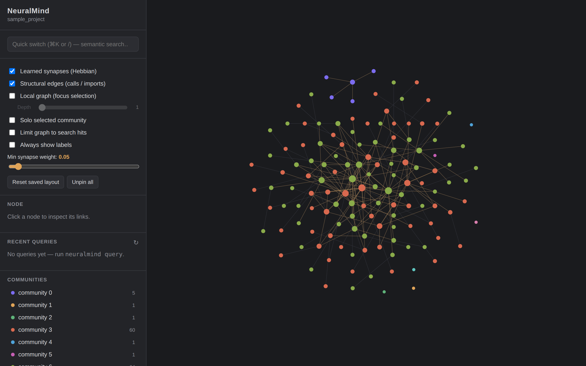
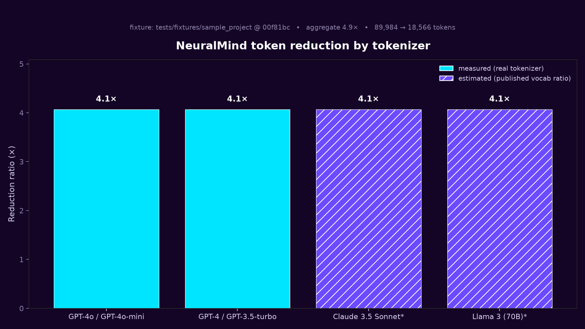

# 🧠 NeuralMind

[](https://pypi.org/project/neuralmind/)
[](https://pepy.tech/project/neuralmind)
[](https://github.com/dfrostar/neuralmind/actions/workflows/ci.yml)
[](https://github.com/dfrostar/neuralmind/actions/workflows/ci-benchmark.yml)
[](https://opensource.org/licenses/MIT)
[](LICENSING.md)
[](https://www.python.org/downloads/)
[](#-security--compliance)

**Persistent memory and context compression for AI coding agents.**

Your agent learns your codebase the way a senior engineer would — what goes
together, what you usually touch next — and remembers it across sessions.
100% local, no telemetry. Side effect: **12–50× cheaper code questions** on real repos, measured in CI on every commit.

> After install, your agent:
> - Boots with `SYNAPSE_MEMORY.md` (learned associations, strongest hub files)
> - Receives PostToolUse compression automatically (Bash output → errors + signals)
> - Queries your codebase in ~800 tokens instead of ~50,000
> - Gets health checks, synapse pruning, audit queries, and code/doc type filtering (v3.1.4+)
>
> **Works with every IDE your team already uses.**

**Website:** [neuralmind.uk](https://neuralmind.uk) · **Docs:** [docs.neuralmind.uk](https://docs.neuralmind.uk/wiki/Home) · **Changelog:** [CHANGELOG.md](CHANGELOG.md) · **Release notes:** [docs/releases/](docs/releases/)



---

## The Problem

Every large engineering organization has the same AI spend problem: token costs compound as the codebase grows, context is re-discovered from scratch on every query, and nobody can explain the ROI.

```
You: "How does authentication work in my codebase?"

❌ Naive:  Load entire codebase → 50,000 tokens → $0.15-$3.75/query
✅ NeuralMind: Smart context → ~800 tokens → $0.002-$0.06/query
```

Engineering leads are stuck between two bad options: let agents burn tokens loading whole files, or hand-curate context windows. Neither scales.

---

## The Solution

NeuralMind is a **code intelligence layer** that deploys in your infrastructure — not a SaaS wrapper, not a model swap. It sits between your agent and your code, learning how your team actually works.

Two cooperating brains:

| Brain | Role |
|-------|------|
| **Claude / GPT / Gemini** (your agent) | Cortex — stateless reasoning over a working-memory window |
| **NeuralMind** | Hippocampus + associative cortex — persistent weighted graph of code nodes |

The agent asks a question. NeuralMind retrieves only the relevant slice (~800 tokens). The more you use it, the smarter the retrieval gets — Hebbian co-activation strengthens edges between code that's used together; unused edges decay.

**NeuralMind makes no network calls of its own.** It processes locally and feeds only the relevant code slice to your AI tool.

---

## Who This Is For

**If your team uses Claude Code, Cursor, Cline, or any MCP agent — NeuralMind makes every agent remember your codebase.**

| Agent | What You Get | Status |
|-------|-------------|--------|
| **Claude Code** | Boots with `SYNAPSE_MEMORY.md`. PostToolUse compression runs automatically. Queries cost ~800 tokens, not ~50,000. | ✅ Tested |
| **Claude Teams** | `neuralmind memory publish` commits a learned-weights bundle (no source code) that teammates' agents inherit on their next session. | ✅ Tested |
| **Cursor** | `neuralmind install-mcp --all` wires any MCP-compatible agent into the same persistent memory. | 🔬 Theoretical |
| **Cline** | Same MCP integration. | 🔬 Theoretical |
| **Continue** | Same MCP integration. | 🔬 Theoretical |
| **Codex** | Same MCP integration. | 🔬 Theoretical |
| **VS Code** | Direct extension + MCP. | ✅ Tested |
| **Vim/Neovim** | Via Claude Code CLI. | ✅ Tested |
| **JetBrains** | Via Claude Code or MCP agent. | ✅ Validated |

Theoretical = MCP is standard protocol. All MCP-compatible agents should work. We haven't physically tested display-server-dependent IDEs (Cursor, Cline, Continue) — Xvfb is not available in our CI.

---

## Benefits

### 1. Cheaper context (measured in CI on every commit)

| What | Measured (CI, 500-line fixture) | On real repos |
|------|---------------------------------|--------------|
| Token reduction on code questions | **6.1×** | **12–50×** (more files to prune ⇒ larger ratio) |
| Regression floor (CI fails below) | 4.0× | — |

The fixture number is the *floor of a floor*: small repo, conservative gate. The mechanism is what scales — the bigger the codebase, the more whole-file context you avoid.

### 2. Learns how you work (the differentiator)

NeuralMind's moat is usage memory: a **Hebbian synapse layer** that learns what your team edits together and surfaces it on future queries.

| Effect | Off | On | Lift |
|--------|-----|-----|------|
| **Synapse recall** — top-k retrieval hit rate (same warm graph) | 77.2% | **83.3%** | **+6.1 pts** |
| **Onboarding lift** — top-k module hit-rate from a committed team baseline | — | — | **+11.6 pts** |

Both are **budget-neutral by design**: recalled nodes *displace* the weakest hits rather than adding tokens.

### 3. Finds the right code (not just less of it)

**100% gold-file recall, MRR 0.96** on the public benchmark (`requests`, `click`). Beats the incumbent `codebase-memory-mcp` on retrieval ranking (0.96 vs 0.23). Reproducible — `python -m evals.public.run`.

### 4. Better-grounded answers (not just shorter)

At a *matched* token budget, NeuralMind's selected context carries more of the gold facts than naive truncation: **faithfulness +0.143, grounding 1.00**.

---

## Use Cases

| I want to… | Read |
|-----------|------|
| Cut AI inference costs on code Q&A | [Cost optimization](docs/use-cases/cost-optimization.md) |
| Set up Claude Code hooks | [Claude Code walkthrough](docs/use-cases/claude-code.md) |
| Measure savings on my own repo | [Benchmark your repo](docs/use-cases/benchmark-your-repo.md) |
| Always-on synapse learning (24/7) | [Always-on](docs/use-cases/always-on.md) |
| Run across multiple codebases | [Multi-project scoping](docs/wiki/Multi-Project-Scoping.md) |
| Deploy in regulated/offline environments | [Air-gapped](docs/use-cases/air-gapped.md) |

---

## Limitations (Read Before Installing)

**What NeuralMind is NOT:**

- **NOT a SaaS wrapper.** It's a code intelligence layer that runs in your infrastructure. We never see your code.
- **NOT a model swap.** It works with whatever agent you already use — Claude, GPT, Gemini, or any MCP-compatible agent.
- **NOT a replacement for Copilot/Cursor.** It composes with them. It's the memory layer that makes every agent smarter.
- **SOC 2-ready posture, certification on the roadmap.** Our architecture *supports* SOC 2 deployment patterns (zero code egress, hash-chained audit log, RBAC). See [commercial-terms.json](commercial-terms.json).
- **NOT SSO/SAML today.** This is a roadmap feature. See [commercial-terms.json](commercial-terms.json) `do_not_market` list.

**Technical limits:**

- **Per-language answer quality is Python-first.** Structural coverage (symbol extraction) is 100% across all 10 bundled languages. Answer quality (faithfulness, grounding) is only measured on Python fixtures.
- **Synapse learning needs sessions.** The Hebbian layer learns from co-activation over time. A fresh install has no learned associations — they accumulate over days/weeks of real use.
- **No real-time cross-machine sync today.** Team memory uses a commit-and-pull model (`neuralmind memory publish`). Real-time sync is roadmap-only.

---

## How to Use

### Install (pick your path)

| Method | Command |
|--------|---------|
| **pip** | `pip install neuralmind` |
| **pipx** | `pipx install neuralmind` (global CLI, no env pollution) |
| **uv** | `uv pip install neuralmind` |
| **Docker** | `docker pull ghcr.io/dfrostar/neuralmind:latest` (multi-arch) |
| **Source** | `git clone https://github.com/dfrostar/neuralmind && pip install -e .` |

### Quick start

```bash
cd your-project
neuralmind build .          # index the codebase (tree-sitter, ~seconds to minutes)

neuralmind wakeup .         # what the agent sees at session start
neuralmind query . "How does authentication work?"  # ~800 tokens, not 50,000

neuralmind install-hooks .  # Claude Code: automatic PostToolUse compression
neuralmind serve .          # Obsidian-style graph view in your browser
neuralmind savings . --cost # measured token savings, priced for your model
neuralmind doctor           # verify the install end to end
```

### Wire up your agent

```bash
# Any MCP-compatible agent (Claude Code, Cursor, Cline, Continue, Codex)
neuralmind install-mcp --all

# Claude Code: install lifecycle hooks (SessionStart, UserPromptSubmit, PreCompact, PostToolUse)
neuralmind install-hooks .

# Team memory: commit learned weights (no source code) for teammates
neuralmind memory publish
```

### Run the benchmark

```bash
# Measure YOUR repo — not a fixture, not a demo
neuralmind benchmark .

# Measure against the public benchmark (requests, click)
neuralmind benchmark . --public

# Retrieval self-probe: does the index find YOUR symbols?
neuralmind probe .
```

---

## ⚡ 30-Second Proof

The clearest evidence the memory is working is the measurable side effect:
the agent stops re-loading context it already understood. Reproduce it on a
fresh clone:

```bash
git clone https://github.com/dfrostar/neuralmind && cd neuralmind
bash scripts/demo.sh
```

Output looks like:

```
  Q: How does authentication work in this codebase?
     naive = 4,736 tok   neuralmind =  829 tok   reduction =   5.7×

  Average reduction:   5.5×  across 3 queries
  Avg context size:    859 tokens  (vs 4,736 naive)
```

The fixture is intentionally tiny (~500 lines) — it runs in CI as a
regression gate. Real repos measure **12–50×** on the same pipeline
([benchmarks](#-benchmarks) · [measured production results](https://neuralmind.uk/effectiveness/)).

Then get your own number:

```bash
pip install neuralmind
cd /path/to/your-repo
neuralmind build .
neuralmind benchmark .
```

---

## 🧠 What You Get

- **Progressive context disclosure (L0–L3).** A question costs ~800 tokens,
  not your whole repo. The agent asks for more depth only where it needs it.
- **A synapse layer that learns.** Hebbian co-activation strengthens edges
  between code that's used together; unused edges decay. Recall is spreading
  activation over that graph — your agent's context gets *better* the more
  you work.
- **Session memory.** `SYNAPSE_MEMORY.md` is exported for Claude Code so
  every session boots already knowing the hub files and learned associations.
- **Tool-output compression + recovery.** PostToolUse hooks compress noisy
  Bash output to errors + signals, and a recovery cache brings back tool
  output the context window dropped.
- **Team memory.** `neuralmind memory publish` commits a learned-weights
  bundle (no source code) that teammates' agents inherit on their next
  session — a fresh clone starts with the team's earned intuition.
- **MCP server for any agent.** Claude Code, Codex, Cursor, Cline, Continue,
  or anything MCP-compatible: `neuralmind install-mcp --all`.
- **Graph view.** `neuralmind serve` renders the index as a force-directed,
  community-coloured graph with the synapse overlay — backlinks, semantic
  quick-switcher, clickable neighbours. There's also a
  [VS Code extension](editors/vscode/).
- **Ten-language code graph.** tree-sitter indexes **Python, TypeScript,
  Go, Rust, Java, C, C++, C#, Ruby, and PHP** out of the box.
- **Business-context synapse seeding.** `seed_from_documents()` builds
  deterministic, LLM-free associations between business documents
  (decisions, SOPs, meeting notes, policies) and your code graph —
  adjacency-matched compounds, title-reference cross-links, frequency-capped
  tags. 56 tests.
- **Team tier ($29/user/mo).** The license buys seats and support: a
  multi-seat license (5-50), priority support, and an annual invoice.
  The features themselves — shared-memory governance, append-only
  hash-chained audit log, self-hosted deployment — run under the
  auto-issued free license at 1 seat, so you can evaluate everything
  before paying. MIT core stays MIT; tier2 is source-available, not
  MIT — see [LICENSING.md](LICENSING.md) and [pricing](https://neuralmind.uk/pricing/).

How it works under the hood: [Architecture](docs/wiki/Architecture.md) ·
[brain-like learning](docs/brain_like_learning.md).

---

## 📊 Benchmarks

Measured, not marketed — the numbers are produced by CI on every commit
(every merged PR carries a sticky benchmark comment) and reproduce locally
with `python -m tests.benchmark.run`:

- **79–100% gold-file recall (93.75% mean) at 45–257× fewer tokens** on the public benchmark.
- **Synapse recall A/B:** +6.1 points top-k hit rate at ±0 token cost.
- **Onboarding lift:** +6.5 points top-k module hit-rate from committed team baseline (a distinct eval from synapse recall A/B above — see `evals/onboarding/`).
- **Real production rebuild:** 48.8× average reduction, 1,033 tokens/query
  ([full field report](https://neuralmind.uk/effectiveness/)).
- **6.1× token reduction** on the CI fixture (500-line, deliberately tiny — the floor of a floor).
- **Retrieval quality (N-15):** graded relevance (0-3), nDCG@5, MRR, recall@k, precision@k + RAGAS faithfulness scoring — 8 CI regression gates, per-shape breakdowns.
- **Content QA (N-16):** book/markdown content retrieval — 30 queries, 11 chapters, 150K-word corpus. N-15 IR metrics + RAGAS on long-form content. `ingest-content` CLI + `benchmark --content` end-to-end command.
- Backend parity gate: the built-in tree-sitter backend is held within
  tolerance of the legacy graphify backend on every PR.



Methodology, gold sets, and community submissions:
[benchmarks/](benchmarks/) · [public methodology](docs/prd/public-benchmark.md).

---

## 🔒 Security & Compliance

- **100% local engine.** NeuralMind makes zero network calls of its own and
  ships no telemetry. Only the minimal relevant slice of code ever reaches
  your AI tool.
- **CycloneDX SBOM per release**, hash-chained audit log (Team tier), signed
  licenses (Ed25519), tarball integrity instructions on every release.
- Live posture page: [neuralmind.uk/security](https://neuralmind.uk/security/) ·
  Policy: [SECURITY.md](SECURITY.md) ·
  [Compliance summary](docs/COMPLIANCE-SUMMARY.md) ·
  [SDLC policy](docs/compliance/SDLC_POLICY.md)

Behavior toggles: `NEURALMIND_BYPASS=1` (skip compression),
`NEURALMIND_SYNAPSE_INJECT=0` (skip prompt-time recall),
`NEURALMIND_SYNAPSE_EXPORT=0` (skip memory export),
`NEURALMIND_TEAM_MEMORY=0` (skip team-bundle import). All fail-open.

---

## 📚 Documentation

| I want to… | Read |
|---|---|
| Install and set up | [Setup guide](docs/wiki/Setup-Guide.md) · [Installation](docs/wiki/Installation.md) |
| See every command | [CLI reference](docs/wiki/CLI-Reference.md) |
| Wire up my agent (MCP) | [Usage](USAGE.md) · [wiki Home](https://docs.neuralmind.uk/wiki/Home) |
| Understand the design | [Architecture](docs/wiki/Architecture.md) · [Limits & failure modes](docs/wiki/Limits-and-Failure-Modes.md) |
| Follow real workflows | [Use-case walkthroughs](docs/use-cases/) (20+) |
| Compare with alternatives | [Comparisons](docs/comparisons/) |
| Evaluate for a team | [Team tier operator guide](docs/wiki/Tier2-Operator-Guide.md) · [Pricing](https://neuralmind.uk/pricing/) |
| Run on multiple codebases | [Multi-project scoping](docs/wiki/Multi-Project-Scoping.md) |
| Upgrade safely | [Upgrade guide](docs/wiki/Upgrade-Guide.md) · [UPGRADING](docs/UPGRADING.md) |
| See what changed | [CHANGELOG](CHANGELOG.md) · [release notes](docs/releases/) · [ROADMAP](ROADMAP.md) |

---

## ❓ FAQ

**How is this different from RAG?** RAG retrieves similar text. NeuralMind
maintains a weighted graph of your code and *learns from use* — retrieval is
spreading activation over structural edges plus Hebbian synapses, disclosed
progressively so the agent pays only for the depth it needs.

**Does my code leave my machine?** No. The engine is fully local. Your agent
still talks to its own model — NeuralMind just makes what it sends smaller.

**What if it doesn't help on my repo?** Run `neuralmind benchmark .` and
read the number. If it's not worth it, uninstall — and see the
[use cases](docs/use-cases/) for guidance on when NeuralMind is the right fit.

**Is the paid tier required?** No. The core is MIT and complete. The Team
tier adds governance, audit, and seat management for organizations.

**What about SOC 2?** Our architecture *supports* SOC 2 deployment
patterns (zero code egress, audit log, RBAC). Certification is on the roadmap.
See [commercial-terms.json](commercial-terms.json).

**What about SSO/SAML?** Roadmap-only. Not available today. See
[commercial-terms.json](commercial-terms.json) `do_not_market` list.

---

## 🤝 Contributing

Contributions welcome — see [CONTRIBUTING.md](CONTRIBUTING.md),
[CODE_OF_CONDUCT.md](CODE_OF_CONDUCT.md), and [SUPPORT.md](SUPPORT.md).
Tests live in `tests/`; `pytest tests/` must pass (the synapse layer's tests
are stdlib-only). Security reports: see [SECURITY.md](SECURITY.md).

## 📄 License

MIT for the core — see [LICENSE](LICENSE). The optional Team tier is
licensed separately — see [LICENSE-COMMERCIAL.md](LICENSE-COMMERCIAL.md).
