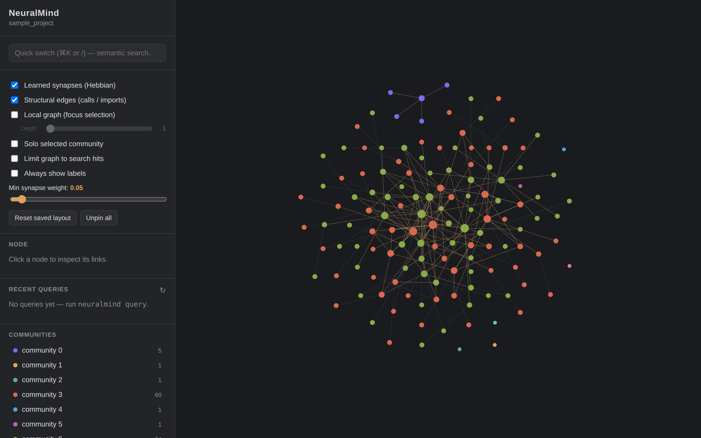
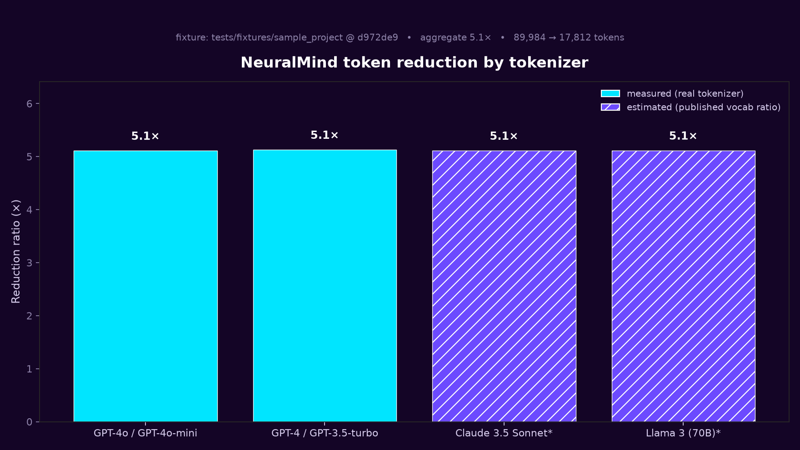

# 🧠 NeuralMind

[](https://pypi.org/project/neuralmind/)
[](https://pepy.tech/project/neuralmind)
[](https://github.com/dfrostar/neuralmind/actions/workflows/ci.yml)
[](https://github.com/dfrostar/neuralmind/actions/workflows/ci-benchmark.yml)
[](https://opensource.org/licenses/MIT)
[](LICENSING.md)
[](https://www.python.org/downloads/)
[](#-security--compliance)

**Persistent codebase memory for AI coding agents — Claude Code, Codex, Cursor, Cline, Continue, and any MCP client.**

Your agent learns your codebase the way a senior engineer would — what goes
together, what you usually touch next — and remembers it across sessions.
Local-first, no telemetry. Side effect: much cheaper code questions —
**46–263× fewer tokens than pasting every source file, at 95% mean
gold-file recall**, on a [public 40-query benchmark](https://neuralmind.uk/benchmark/)
that publishes every miss.

> After install, your agent:
> - Boots with `SYNAPSE_MEMORY.md` (learned associations, strongest hub files)
> - Recalls related files for each prompt you send (Claude Code `UserPromptSubmit` hook)
> - Queries your codebase in ~800 tokens instead of ~50,000
> - Gets health checks, synapse pruning, audit queries, and code/doc type filtering (v3.1.4+)
> - Gets a `pre-commit` warning when a change skips a pattern its own peers share — the eleventh handler that forgot the auth check the other ten have (v3.2.0+)
> - Gets compliance annotations it can actually trust — a version string or an SVG path is no longer reported as a SOC 2 control (v3.3.0+)
> - Searches your prose too: `ingest-content` indexes a book or docs tree into its own project, re-embeds only what changed, and shows a progress bar with an ETA while it works (v3.4.0+)
> - Thinks with your brain, not just your code: 6 SOTA synaptic learning techniques (STC, SAMPL, resource STDP, FOK, lateral inhibition, replay) plus intent-aware ranking that reads "how does X implement Y" as a question about code, and ranks implementation above docstrings for it (v3.9.0+)
> - **New in v4.6.1:** the MCP server applies your security settings. `security.roles` and `security.rate_limit` in `neuralmind-backend.yaml` used to be ignored, so a caller could declare `admin` and reach every tool even where the policy left `admin` out; now a role gets only the tools the policy lists, and a policy without `admin` caps what any caller can reach; an empty or malformed policy refuses calls instead of falling back to the defaults. No `security:` block, no change — if you have one, check it before upgrading, because it replaces the defaults ([release notes](docs/releases/RELEASE_NOTES_v4.6.1.md))
> - **v4.6.0:** one keyword index for docs and code, on by default — so on "how does X work" questions the code that does X can win an L3 slot on keywords too, not just the README that mentions it. Measured before it shipped (reproducible on demand, not a CI gate; one of the six repos is private): mean hit@5 72.8% → 79.4% across 30 questions on each of six repos — pre-registered and committed for the five public repos, plus a private 383-file repository — and public-benchmark gold-file recall 93.75% → 95%. Losses published: `requests` −1 question, `rich` MRR 0.71 → 0.60, a new `click` public-benchmark miss (click 100% → 85.71%), and the private 383-file repo at 73% / 0.60, short of its 80% / 0.65 target. `query --explain` now shows the query intent L3 ranked with; five more ranking changes were measured, lost, and ship off behind flags. Run `neuralmind build` once after upgrading ([release notes](docs/releases/RELEASE_NOTES_v4.6.0.md))
> - **Also in v4.6.0:** what the docs described, the product now does. A repeat read of an unchanged file in the same Claude Code session comes back as a short stub, and the next read is always full; decisions go STALE when a commit changes their files (`neuralmind init-hook .` runs `decisions scan` after every commit); team governance is enforced on `memory publish`, and `remove-edge` retracts an association for the whole team. The unused co-access module is gone, and `cognition-loop` was rebuilt so it no longer deletes learned memory ([release notes](docs/releases/RELEASE_NOTES_v4.6.0.md))
> - **v4.5.1:** decision memory answers questions. `neuralmind decisions query` and the MCP decision tools match any word of a question, best match first, where every word used to be required; `neuralmind_memory_search`, `neuralmind_memory_timeline` and `neuralmind_memory_get` work for the default `builder` and `reader` roles instead of returning `security_denied`; and `neuralmind decisions eval` no longer touches your project's decisions ([release notes](docs/releases/RELEASE_NOTES_v4.5.1.md))
> - **v4.5.0:** numbers measured on your project. `neuralmind eval .` scores retrieval against the questions and gold files in your `.neuralmind.eval.yaml` (hit@1 / hit@5 / MRR, with a history); every reduction ratio divides by the measured size of your code instead of a fixed 50K guess; queries can be read-only (`--no-learn`, MCP `learn: false`, `NEURALMIND_NO_LEARN=1`) so evals never train on their own test; and the index covers what git covers — `.gitignore` is honoured ([release notes](docs/releases/RELEASE_NOTES_v4.5.0.md))
> - **v4.4.0:** never answers from a stale index without saying so. `doctor`, `health`, `build` and the agent's first `neuralmind_wakeup` compare the code graph with the files on disk; `Index is stale: 51 files missing from graph…` arrives before any answer does. `build --regenerate-graph` escapes an old graphify graph, every build purges vectors for code that no longer exists, and queries load the index without rebuilding it or printing a line ([release notes](docs/releases/RELEASE_NOTES_v4.4.0.md))
>
> **Works with every IDE your team already uses.**

**Website:** [neuralmind.uk](https://neuralmind.uk) · **Docs:** [docs.neuralmind.uk](https://docs.neuralmind.uk/wiki/Home) · **Changelog:** [CHANGELOG.md](CHANGELOG.md) · **Release notes:** [docs/releases/](docs/releases/)



---

## The Problem

Every large engineering organization has the same AI spend problem: token costs compound as the codebase grows, context is re-discovered from scratch on every query, and nobody can explain the ROI.

```
You: "How does authentication work in my codebase?"

❌ Naive:  Load entire codebase → 50,000 tokens → $0.15-$3.75/query
✅ NeuralMind: Smart context → ~800 tokens → $0.002-$0.06/query
```

Engineering leads are stuck between two bad options: let agents burn tokens loading whole files, or hand-curate context windows. Neither scales.

---

## The Solution

NeuralMind is a **code intelligence layer** that deploys in your infrastructure — not a SaaS wrapper, not a model swap. It sits between your agent and your code, learning how your team actually works.

Two cooperating brains:

| Brain | Role |
|-------|------|
| **Claude / GPT / Gemini** (your agent) | Cortex — stateless reasoning over a working-memory window |
| **NeuralMind** | Hippocampus + associative cortex — persistent weighted graph of code nodes |

The agent asks a question. NeuralMind retrieves only the relevant slice (~800 tokens). The more you use it, the smarter the retrieval gets — Hebbian co-activation strengthens edges between code that's used together; unused edges decay.

**NeuralMind sends no telemetry and transmits no repository content off your machine.** It processes locally and hands only the relevant code slice to your AI tool on the same machine — what that tool then sends to its own model provider is between you and it. Its one outbound request is a one-time download of a public embedding model on first build — pre-seedable, see [Run NeuralMind air-gapped](docs/use-cases/air-gapped.md).

---

## Who This Is For

**If your team uses Claude Code, Cursor, Cline, or any MCP agent — NeuralMind makes every agent remember your codebase.**

| Agent | What You Get | Status |
|-------|-------------|--------|
| **Claude Code** | Boots with `SYNAPSE_MEMORY.md`. Prompt-time recall and a stale-decision guard run automatically. Queries cost ~800 tokens, not ~50,000. | ✅ Tested |
| **Claude Teams** | `neuralmind memory publish` writes a learned-weights bundle (no source code); commit it and teammates' agents inherit it on their next session. | ✅ Tested |
| **Cursor** | `neuralmind install-mcp --all` wires any MCP-compatible agent into the same persistent memory. | 🔬 Theoretical |
| **Cline** | Same MCP integration. | 🔬 Theoretical |
| **Continue** | Same MCP integration. | 🔬 Theoretical |
| **Codex** | `codex mcp add neuralmind -- neuralmind-mcp`. Config registration and the MCP protocol itself (`initialize`, `tools/list`, real tool calls) are confirmed working against the actual binary; Codex's own agent loop calling a tool mid-conversation has not been observed (needs a live API key). See [the Codex ecosystem comparison](docs/comparisons/vs-codex-cli-memory.md) for what was actually checked. | 🔬 Theoretical |
| **Hermes-Agent** | Native MCP client discovers `neuralmind-mcp` at startup — no bridge process. Or skip MCP and install the portable skill straight from GitHub: `hermes skills install dfrostar/neuralmind/skills/neuralmind`. A catalog entry is [submitted as NousResearch/hermes-agent#97207](https://github.com/NousResearch/hermes-agent/pull/97207) — a contributor's review comments are resolved, but it carries no formal review and is not merged. | 🔬 Theoretical |
| **OpenClaw** | `openclaw mcp set neuralmind '{"command":"neuralmind-mcp","args":[]}'` wires it into the same shared memory. The portable skill is also listed on ClawHub (community channel): `openclaw skills install @dfrostar/neuralmind`. | 🔬 Theoretical |
| **Agent Zero** | Same MCP integration, pointed at `neuralmind-mcp`. Listed in Agent Zero's in-app Plugin Hub: the [`a0-plugins` index entry](https://github.com/agent0ai/a0-plugins/tree/main/plugins/neuralmind) merged 2026-08-31 ([agent0ai/a0-plugins#499](https://github.com/agent0ai/a0-plugins/pull/499)). Installing from the Hub clones this repository as a plugin, which exposes the portable skill — it does not install the package or register the MCP server, so `pip install neuralmind` and the MCP config are still manual. `plugin.yaml` (repo root) is the manifest their registry CI fetches; [`integrations/a0-plugins/`](integrations/a0-plugins/) mirrors the merged entry. | 🔬 Theoretical |
| **VS Code** | Direct extension + MCP. | ✅ Tested |
| **Vim/Neovim** | Via Claude Code CLI. | ✅ Tested |
| **JetBrains** | Via Claude Code or MCP agent. | ✅ Validated |

Theoretical = MCP is standard protocol. All MCP-compatible agents should work. We haven't physically tested display-server-dependent IDEs (Cursor, Cline, Continue) — Xvfb is not available in our CI. Hermes-Agent, OpenClaw, and Agent Zero are covered by host-specific notes in [`skills/neuralmind/SKILL.md`](skills/neuralmind/SKILL.md) and a CI check ([`tests/test_skill_manifest.py`](tests/test_skill_manifest.py)) that keeps the portable skill's identity in sync with each registry's rules, but none has been physically driven end-to-end yet either.

---

## Benefits

### 1. Cheaper context

| Evidence | Where it's measured | Result |
|----------|---------------------|--------|
| **Public benchmark** — reproducible on demand | 40 pre-registered queries on `requests`, `click`, `flask`, `rich` (`python -m evals.public.run`) | **46–263× fewer tokens** than pasting every source file, at **95% mean gold-file recall** (85.71–100% per repo) |
| **Retrieval eval (v4.6.0)** — reproducible on demand, not a CI gate | 30 questions × 5 public repos (`requests`, `click`, `flask`, `rich`, this repo; pre-registered, committed) + 1 private 383-file repo (`pip install -e . tiktoken`, then `NEURALMIND_ORT_THREADS=1 python -m evals.retrieval.run --public-benchmark`; raw output in [`bench/retrieval/`](bench/retrieval/)) | mean hit@5 **72.8% → 79.4%** (75.3% → 80.7% on the five public repos alone) for one BM25 index over docs and code. Losses: `requests` −1 question, `rich` MRR 0.71 → 0.60, a new `click` public-benchmark miss (click 100% → 85.71%), and the private 383-file repo at 73% / 0.60, short of its 80% / 0.65 target |
| **CI regression gate** — every PR | ~500-line fixture (`python -m tests.benchmark.run`) | the build fails below **4.0×**; measured **5.1×** at v4.3.4 |
| **Field reports** — `neuralmind benchmark .` | real private repos, before v4.5.0, against the fixed 50K-token estimate the CLI then used (it now divides your measured code) | **12–50×** typical range |

The fixture number is the *floor of a floor*: small repo, conservative gate. The mechanism is what scales — the bigger the codebase, the more whole-file context you avoid.

### 2. Learns how you work (the differentiator)

NeuralMind's moat is usage memory: a **Hebbian synapse layer** that learns what your team edits together and surfaces it on future queries.

| Effect | What CI enforces | Observed magnitude |
|--------|------------------|--------------------|
| **Synapse recall** — top-k retrieval hit rate (same warm graph) | recall-on ≥ recall-off, at a neutral token budget | **+3.5 to +14 pts** across runs |
| **Onboarding lift** — top-k module hit-rate from a committed team baseline | lift ≥ 0, averaged over 3 runs | **+0.9 to +11.6 pts** across runs |

Both are **budget-neutral by design**: recalled nodes *displace* the weakest hits rather than adding tokens.

**Why a range, not a number.** Both A/Bs run against a ~500-line fixture through a ChromaDB HNSW index, so the deltas are small and jitter between runs — CI averages the onboarding lift over three runs for exactly that reason. What CI guarantees is the *direction*; the magnitude is whatever your own repo produces. Run `python -m tests.benchmark.run` for yours.

### 3. Context budget management (v3.13.0+)

Every query gets a fixed token budget (default 8,000 tokens, matching lean-ctx). If the assembled context would exceed it, lower-priority layers are trimmed first — L3 search results, then L2 on-demand modules, then L1 summary. L0 identity is never trimmed. Budget warnings log at 80% usage.

```python
result = mind.query("How does auth work?", context_budget=6000)
# Context trimmed to fit 6000 tokens, L3 removed first
```

### 4. Session summaries (v3.13.0+)

Periodic session digests (every 25 tool calls) capture what was done, key decisions, files touched, and commands run. Stored as markdown under `.neuralmind/summaries/`, semantically recallable via the vector index. Auto-pruned (max 100 per project).

```bash
neuralmind status .  # shows recent summaries
```

### 5. Read dedup for repeat reads (v4.6.0+)

When your agent reads a file it already read in this Claude Code session and
the content hasn't changed, the Read hook replaces the repeat with a short stub
that says so: the earlier result is still current. The next read of that file
always goes through in full, so an agent whose earlier copy has left its
context gets it back by reading again. Reads are tracked per session and per
subagent, keyed on the exact text and range returned. A new, resumed, cleared
or compacted session starts fresh. Reads under 2,000 characters are never
stubbed.

It uses Claude Code's PostToolUse `updatedToolOutput`, keeping the Read tool's
own output shape. Claude Code ignores a replacement that doesn't match and
delivers the original read, so a shape change on Claude Code's side means no
dedup rather than a broken read. MCP-only agents have no PostToolUse hook and
are unaffected. Off with
`NEURALMIND_READ_DEDUP=0`. **Not benchmarked yet**, so no savings figure here.

The v3.13 co-access module (`graph_traversal`) was removed rather than wired
in: every query already strengthens the edges between the results it returns
together, and the module's copies went to a namespace recall never read. The
"preload related files" idea it described was never built.

### 6. Cognition loop (on demand; rebuilt in v4.6.0)

`neuralmind cognition-loop .` runs one maintenance pass over the learned
memory: the synapse store's half-life decay (it charges only the time since the
last decay, so running it often never decays anything twice) and cleanup of
expired read-dedup rows.

```bash
neuralmind cognition-loop .   # run a pass now; safe to put in cron
```

Nothing schedules it, by design: Claude Code's `session-start` hook already
decays at every session start, and `neuralmind watch` every 10 minutes. Use it
when you run neither, for example with an MCP-only client.

**A miss, published:** before v4.6.0 this command ran its own SQL that deleted
most learned edges idle for more than about two days, replayed recent queries
into edges recall never read, and deleted session summaries older than 30
days. If you ran it, `neuralmind memory reset --namespace traversal` clears the
leftover rows.

### 7. Decision memory + stale-decision guard (v4.1.0+; automatic invalidation v4.6.0+)

Store architecture decisions with rationale, evidence, affected files and the
commit they came from (`neuralmind decisions record`), and search them
(`neuralmind decisions query`). The commit history retires them for you: the
post-commit hook from `neuralmind init-hook .` runs `neuralmind decisions scan`,
which marks a decision STALE when the commit changed one of its files after the
decision was recorded. Any change counts; there's no diff analysis. The commit
that lands the change a decision describes leaves it ACTIVE.

Before your agent edits a file, a `PreToolUse` hook surfaces any decision
governing it that is STALE or INVALIDATED, with the reason, the decision's id,
and `neuralmind decisions restore <id>` for one that still holds. Re-run
`neuralmind init-hook .` on an existing checkout to pick up the scan. Pulls and
rebases don't run post-commit hooks, so a decision whose files changed only in
pulled commits stays ACTIVE until one of your own commits touches them.

Search takes keywords or a question: any word can match, and decisions matching
more of the words rank first (v4.5.1+). `neuralmind decisions eval --queries FILE`
scores it against questions with known answers; the
[Memory Layer wiki](docs/wiki/Memory-Layer.md#eval-harness) has the results.

Walkthrough: [Keep decision memory honest across commits](docs/use-cases/decision-memory-across-commits.md).

### 8. Finds the right code (not just less of it)

**95% mean gold-file recall (85.71–100% per repo)** across 40 pre-registered queries on four pinned OSS repos (`requests`, `click`, `flask`, `rich`) — every miss published, not rounded away. Reproducible — `python -m evals.public.run`. A separate, off-by-default eval on `requests`/`click` only put retrieval ranking at MRR 0.96 against the incumbent `codebase-memory-mcp`'s 0.23; that one has not been re-verified against the current four-repo corpus.

### 9. Answer grounding vs. naive truncation (currently a loss)

At a *matched* token budget, the faithfulness eval asks whether NeuralMind's
selected context carries more of the gold facts than naive truncation. On the
~500-line reference fixture, which mixes code with prose chapter summaries,
truncation currently wins slightly: **0.451 vs 0.505 expected-fact recall, a
−0.054 delta** at v4.3.4. CI fails the build if the mean delta drops below
**−0.10**; earlier releases measured +0.013 to +0.143. We publish it as a loss
rather than drop the eval.

### 10. Tool-output compression (measured, and removed)

Through v4.4.0, NeuralMind's PostToolUse hooks handed Claude Code compressed
copies of `Bash` and `Grep` output. Claude Code adds a hook's
`additionalContext` next to the tool result rather than replacing it, so the
copies cost tokens instead of saving them: **+17.5% on Bash calls and +22.1% on
content-mode Grep**, and the Read hook never saw Claude Code's payload at all
([compression benchmark](docs/benchmarks/compression.md)). From v4.5.0 the
hooks inject nothing, so Claude sees exactly the tool result. The compressors
themselves would cut 66–87%, but a Read replaced by its skeleton would keep
none of the file's source lines. So nothing replaces tool output until something
keeps what the agent needs.

---

## Use Cases

| I want to… | Read |
|-----------|------|
| Cut AI inference costs on code Q&A | [Cost optimization](docs/use-cases/cost-optimization.md) |
| Set up Claude Code hooks | [Claude Code walkthrough](docs/use-cases/claude-code.md) |
| Catch code that drifts from its own patterns before it ships | [Review before push](docs/use-cases/review-before-push.md) |
| Measure savings on my own repo | [Benchmark your repo](docs/use-cases/benchmark-your-repo.md) |
| Test a ranking change on my repo before trusting it | [A/B-test a ranking change](docs/use-cases/ab-test-a-ranking-change.md) |
| Always-on synapse learning (24/7) | [Always-on](docs/use-cases/always-on.md) |
| Run across multiple codebases | [Multi-project scoping](docs/wiki/Multi-Project-Scoping.md) |
| Deploy in regulated/offline environments | [Air-gapped](docs/use-cases/air-gapped.md) |

---

## Limitations (Read Before Installing)

**What NeuralMind is NOT:**

- **NOT a SaaS wrapper.** It's a code intelligence layer that runs in your infrastructure. We never see your code.
- **NOT a model swap.** It works with whatever agent you already use — Claude, GPT, Gemini, or any MCP-compatible agent.
- **NOT a replacement for Copilot/Cursor.** It composes with them. It's the memory layer that makes every agent smarter.
- **SOC 2-ready posture, certification on the roadmap.** Our architecture *supports* SOC 2 deployment patterns (an engine that transmits no repository content, hash-chained audit log, per-tool MCP permissions). See [commercial-terms.json](commercial-terms.json).
- **NOT SSO/SAML today.** This is a roadmap feature. See [commercial-terms.json](commercial-terms.json) `do_not_market` list.

**Technical limits:**

- **Per-language answer quality is Python-first.** Structural coverage (symbol extraction) is 100% across all 10 bundled languages. Answer quality (faithfulness, grounding) is only measured on Python fixtures.
- **Synapse learning needs sessions.** The Hebbian layer learns from co-activation over time. A fresh install has no learned associations — they accumulate over days/weeks of real use.
- **No real-time cross-machine sync today.** Team memory uses a commit-and-pull model (`neuralmind memory publish`). Real-time sync is roadmap-only.

---

## How to Use

### Install (pick your path)

| Method | Command |
|--------|---------|
| **pip** | `pip install neuralmind` |
| **pipx** | `pipx install neuralmind` (global CLI, no env pollution) |
| **uv** | `uv pip install neuralmind` |
| **Docker** | `docker pull ghcr.io/dfrostar/neuralmind:latest` (multi-arch) |
| **Source** | `git clone https://github.com/dfrostar/neuralmind && pip install -e .` |

### Quick start

```bash
cd your-project
neuralmind build .          # index the codebase (tree-sitter, ~seconds to minutes)

neuralmind wakeup .         # what the agent sees at session start
neuralmind query . "How does authentication work?"  # ~800 tokens, not 50,000

neuralmind install-hooks .  # Claude Code: session memory, prompt recall, stale-decision guard
neuralmind serve .          # Obsidian-style graph view in your browser
neuralmind savings . --cost # measured token savings, priced for your model
neuralmind doctor           # verify the install end to end — incl. graph vs files on disk
```

### Is the index in step with the code? *(v4.4.0+)*

A code graph that lags the code still "works" — it just answers from code that
no longer exists. NeuralMind now checks, both ways, whatever tool built the graph:

```bash
neuralmind doctor .                     # [FAIL] Code graph: ... 51 files on disk not in graph
neuralmind health .                     # exit 1 when the graph and the code disagree
neuralmind build . --regenerate-graph   # replace a stale graphify graph with the built-in one
neuralmind build . --strict             # CI: exit 3 instead of embedding a failing graph
```

Your agent sees it too: its first `neuralmind_wakeup` starts with
`Index is stale: … Run neuralmind build . --regenerate-graph.` whenever the graph
lags. Pin the graph source with `graph_source: auto | builtin | graphify` in
`.neuralmind.yaml`. Walkthrough: [Recover from a stale code graph](docs/use-cases/recover-from-a-stale-graph.md).

### Measure it on your own questions *(v4.5.0+)*

```bash
neuralmind eval . --suggest --write   # draft .neuralmind.eval.yaml: questions + the file that answers each
neuralmind eval .                     # hit@1 / hit@5 / MRR, read-only — never trains on its own test
neuralmind eval . --report            # the run history as a markdown table
```

Every reduction ratio (`benchmark`, `savings`, `cost`, `build --dry-run`) now
divides by the measured token count of the code the index covers — prose like
a changelog is left out, and it is counted at the same ~4 chars/token as the
context — and the index covers what git covers. `benchmark` prints the old
fixed-50K ratio beside it, so older numbers stay comparable. Walkthrough:
[Measure retrieval on your own repo](docs/use-cases/measure-retrieval-on-your-repo.md).

### Test a ranking change before you trust it *(v4.6.0+)*

```bash
neuralmind build .                                         # writes the v4.6.0 docs + code keyword index
NEURALMIND_BM25_UNIFIED=0 neuralmind eval . --no-history   # v4.5.0 ranking, same questions
neuralmind eval .                                          # v4.6.0 ranking
NEURALMIND_L3_PER_FILE=2 neuralmind eval . --no-history    # an off-by-default research flag
```

Every ranking flag is read at query time, so one build serves every variant.
v4.6.0's own default was chosen this way, across six repos and a keep rule
fixed in advance — raw output in [`bench/retrieval/`](bench/retrieval/README.md).
Walkthrough: [A/B-test a ranking change on your own repo](docs/use-cases/ab-test-a-ranking-change.md).

### Index prose, not just code *(v3.4.0+)*

A book, a docs tree, a research folder — `ingest-content` indexes a corpus of
Markdown/text into its own project, so it never gets folded into the enclosing
repo:

```bash
neuralmind ingest-content chapters --dry-run       # preview: files, sizes, chunk counts
neuralmind ingest-content chapters --content-only  # index the prose, skip the code graph
neuralmind status book                             # nodes indexed, chunks, last ingest
```

Re-runs are incremental — only files whose content changed are re-embedded, and
chunks from shortened or deleted files are evicted. Long embeds show a progress
bar with an ETA on a terminal, and plain milestone lines off one (CI, an agent
shell), so a slow run is never mistaken for a hung one.

### Wire up your agent

```bash
# Claude Code, Cursor, Cline, VS Code, Claude Desktop — registers with every detected client
neuralmind install-mcp --all
# Codex, Continue, or any other MCP client: point it at the stdio server
codex mcp add neuralmind -- neuralmind-mcp

# Claude Code: install lifecycle hooks (SessionStart, UserPromptSubmit, PreCompact, PostToolUse, PreToolUse, Stop, SessionEnd)
neuralmind install-hooks .

# Team memory: commit learned weights (no source code) for teammates
neuralmind memory publish
```

### Run the benchmark

```bash
# Measure YOUR repo — not a fixture, not a demo
neuralmind benchmark .

# Reproduce the public benchmark (requests, click, flask, rich) — needs a source checkout
neuralmind benchmark . --public

# Retrieval self-probe: does the index find YOUR symbols?
neuralmind probe .
```

---

## ⚡ 30-Second Proof

The clearest evidence the memory is working is the measurable side effect:
the agent stops re-loading context it already understood. Reproduce it on a
fresh clone:

```bash
git clone https://github.com/dfrostar/neuralmind && cd neuralmind
bash scripts/demo.sh
```

Output looks like:

```
  Q: How does authentication work in this codebase?
     naive = 4,736 tok   neuralmind =  829 tok   reduction =   5.7×

  Average reduction:   5.5×  across 3 queries
  Avg context size:    859 tokens  (vs 4,736 naive)
```

The fixture is intentionally tiny (~500 lines) — it runs in CI as a
regression gate. Before v4.5.0, `neuralmind benchmark` reported **12–50×** on
real repos against a fixed 50K-token estimate; it now divides your measured
code, so the ratio grows with the repo. The public benchmark measures
**46–263×** against every source file
([benchmarks](#-benchmarks) · [production field report](https://neuralmind.uk/field-reports/measure-memory-across-a-refactor/)).

Then get your own number:

```bash
pip install neuralmind
cd /path/to/your-repo
neuralmind build .
neuralmind benchmark .
```

---

## 🧠 What You Get

- **Progressive context disclosure (L0–L3).** A question costs ~800 tokens,
  not your whole repo. The agent asks for more depth only where it needs it.
- **A synapse layer that learns.** Hebbian co-activation strengthens edges
  between code that's used together; unused edges decay. Recall is spreading
  activation over that graph — your agent's context gets *better* the more
  you work.
- **Session memory.** `SYNAPSE_MEMORY.md` is exported for Claude Code so
  every session boots already knowing the hub files and learned associations.
- **Read dedup.** In Claude Code, a repeat read of an unchanged file comes back
  as a short stub instead of the whole file again; the next read is always full.
- **`neuralmind last`.** The Bash hook caches the latest successful command's
  output, credentials redacted, so it can be printed again without re-running
  the command. A failing command fires a different hook event and isn't
  cached.
- **Team memory.** `neuralmind memory publish` writes a learned-weights
  bundle (no source code); commit it and teammates' agents inherit it on
  their next session — a fresh clone starts with the team's earned intuition.
  With team governance set up, publish honours the admin's scope and weight
  threshold, `team governance remove-edge` retracts an association for every
  teammate, and each publish, import and review is audited
  ([walkthrough](docs/use-cases/govern-team-memory.md)).
- **Commit-time drift guard.** `neuralmind drift` reads your staged diff,
  maps changed lines to graph symbols, and flags one that skips a pattern a
  strong majority of its siblings share — before it ships, not after a
  query happens to surface the cluster. `neuralmind init-hook` wires it into
  `pre-commit` automatically (warn by default; `--strict` to block).
- **MCP server for any agent.** Claude Code, Codex, Cursor, Cline, Continue,
  or anything MCP-compatible: `neuralmind install-mcp --all`.
- **Graph view.** `neuralmind serve` renders the index as a force-directed,
  community-coloured graph with the synapse overlay — backlinks, semantic
  quick-switcher, clickable neighbours. There's also a
  [VS Code extension](editors/vscode/).
- **Ten-language code graph.** tree-sitter indexes **Python, TypeScript,
  Go, Rust, Java, C, C++, C#, Ruby, and PHP** out of the box.
- **Business-context synapse seeding.** `seed_from_documents()` builds
  deterministic, LLM-free associations between business documents
  (decisions, SOPs, meeting notes, policies) and your code graph —
  adjacency-matched compounds, title-reference cross-links, frequency-capped
  tags. 56 tests.
- **Team tier ($29/user/mo).** The license buys seats and support: a
  multi-seat license (5-50), priority support, and an annual invoice.
  The features themselves — shared-memory governance, append-only
  hash-chained audit log, self-hosted deployment — run under the
  auto-issued free license at 1 seat, so you can evaluate everything
  before paying. MIT core stays MIT; tier2 is source-available, not
  MIT — see [LICENSING.md](LICENSING.md) and [pricing](https://neuralmind.uk/pricing/).

How it works under the hood: [Architecture](docs/wiki/Architecture.md) ·
[brain-like learning](docs/brain_like_learning.md).

---

## 📊 Benchmarks

Measured, not marketed. The fixture numbers are produced by CI on every commit
(every merged PR carries a sticky benchmark comment) and reproduce locally
with `python -m tests.benchmark.run`; the public benchmark reproduces on
demand with `python -m evals.public.run`, raw per-query data committed:

- **85.71–100% gold-file recall (95% mean) at 46–263× fewer tokens** than pasting every source file on the public benchmark — 3 of 40 queries missed, every one published, and a bare vector-RAG baseline matches or beats it on recall at fewer tokens ([where NeuralMind loses](docs/benchmarks/public.md#where-neuralmind-loses)).
- **Synapse recall A/B:** lifts top-k hit rate at ±0 token cost — +3.5 to +14 points across runs; CI gates the direction, not the magnitude.
- **Onboarding lift:** lifts top-k module hit-rate from a committed team baseline — +0.9 to +11.6 points across runs (a distinct eval from the synapse recall A/B above — see `evals/onboarding/`).
- **Real production rebuild:** 48.8× average reduction, 1,033 tokens/query, against the fixed 50K-token estimate the CLI used before v4.5.0
  ([full field report](https://neuralmind.uk/field-reports/measure-memory-across-a-refactor/)).
- **5.1× token reduction** on the CI fixture at v4.3.4 (500-line, deliberately tiny — the floor of a floor; the build fails below 4.0×).
- **Retrieval quality (N-15):** graded relevance (0-3), nDCG@5, MRR, recall@k, precision@k + RAGAS faithfulness scoring — 8 CI regression gates, per-shape breakdowns.
- **Content QA (N-16):** book/markdown content retrieval — 30 queries, 11 chapters, 150K-word corpus. N-15 IR metrics + RAGAS on long-form content. `ingest-content` CLI + `benchmark --content` end-to-end command.
- Backend parity gate: the built-in tree-sitter backend is held within
  tolerance of the legacy graphify backend on every PR.
- **Tool-output compression:** measured on v4.3.4, the PostToolUse hooks added
  17.5% to Bash calls and 22.1% to content-mode Grep rather than saving
  anything; they now inject nothing
  ([compression benchmark](docs/benchmarks/compression.md)).



Methodology, gold sets, and community submissions:
[benchmarks/](benchmarks/) · [public methodology and results](docs/benchmarks/public.md) ·
[tool-output compression](docs/benchmarks/compression.md).

<!-- COMMUNITY-BENCHMARKS:START -->
| Project | Lang | Nodes | Wakeup | Avg Query | Reduction (vs fixed 50K) | Reduction (vs measured code) | Model | Submitted |
|---------|------|------:|-------:|----------:|----------:|----------:|-------|-----------|
| project-alpha | JavaScript | 241 | 341 | 739 | **65.6×** | — | Claude 3.5 Sonnet | [@dfrostar](https://github.com/dfrostar) · 2025-10-01 |
| ts-saas-platform (anon) | TypeScript | 9,293 | 455 | 1,033 | **48.8×** | — | — | [@dfrostar](https://github.com/dfrostar) · 2026-07-20 |
| project-beta | Python | 1,626 | 412 | 891 | **46.0×** | — | Claude 3.5 Sonnet | [@dfrostar](https://github.com/dfrostar) · 2025-10-01 |

_3 submission(s). **vs fixed 50K**: a fixed 50,000-token estimate over tokens per question — the one ratio every row shares, so it tracks context size, not repo size. **vs measured code**: the submitter's measured code over tokens per question (v4.5.0+ submissions). See the [JSON data](docs/community-benchmarks.json) for notes and verification commands, or the [interactive dashboard](https://docs.neuralmind.uk/benchmarks/) for scatter + by-language charts._
<!-- COMMUNITY-BENCHMARKS:END -->

---

## 🔒 Security & Compliance

- **Local engine, no telemetry by default.** NeuralMind transmits no
  repository content and ships no telemetry in its default configuration.
  Only the minimal relevant slice of code ever reaches your AI tool. The
  only outbound requests it makes by default are a one-time fetch of a
  public embedding model on first build (carrying nothing about your code;
  pre-seed it and the install never reaches the network at all) and,
  **only if you explicitly opt in** with `NEURALMIND_LLM_SEED=1` +
  `ANTHROPIC_API_KEY`, a call that sends README/architecture-doc prose
  (never code, never other files) to Anthropic to seed synapse edges. No
  code path ingests video, image, or audio files at all. Full disclosure:
  [`docs/compliance/THIRD_PARTY_LLM_DISCLOSURE.md`](docs/compliance/THIRD_PARTY_LLM_DISCLOSURE.md).
- **CycloneDX SBOM per release**, hash-chained audit logs (the query trail in
  the core; the governance trail in the Team modules, free at 1 seat), signed
  licenses (Ed25519), tarball integrity instructions on every release.
- Live posture page: [neuralmind.uk/security](https://neuralmind.uk/security/) ·
  Policy: [SECURITY.md](SECURITY.md) ·
  [Compliance summary](docs/COMPLIANCE-SUMMARY.md) ·
  [Third-party LLM & media disclosure](docs/compliance/THIRD_PARTY_LLM_DISCLOSURE.md) ·
  [SDLC policy](docs/compliance/SDLC_POLICY.md)

Behavior toggles: `NEURALMIND_BYPASS=1` (switch off every NeuralMind hook action),
`NEURALMIND_SYNAPSE_INJECT=0` (skip prompt-time recall),
`NEURALMIND_SYNAPSE_EXPORT=0` (skip memory export),
`NEURALMIND_TEAM_MEMORY=0` (skip team-bundle import),
`NEURALMIND_STALE_GUARD=0` (skip the PreToolUse stale-decision guard),
`NEURALMIND_READ_DEDUP=0` (never stub a repeat read),
`NEURALMIND_DECISION_SCAN=0` (skip the post-commit decision scan). All fail-open.

---

## 📚 Documentation

| I want to… | Read |
|---|---|
| Install and set up | [Setup guide](docs/wiki/Setup-Guide.md) · [Installation](docs/wiki/Installation.md) |
| See every command | [CLI reference](docs/wiki/CLI-Reference.md) |
| Wire up my agent (MCP) | [Usage](USAGE.md) · [wiki Home](https://docs.neuralmind.uk/wiki/Home) |
| Understand the design | [Architecture](docs/wiki/Architecture.md) · [Limits & failure modes](docs/wiki/Limits-and-Failure-Modes.md) |
| Follow real workflows | [Use-case walkthroughs](docs/use-cases/) (20+) |
| Compare with alternatives | [Comparisons](docs/comparisons/) |
| Evaluate for a team | [Team tier operator guide](docs/wiki/Tier2-Operator-Guide.md) · [Pricing](https://neuralmind.uk/pricing/) |
| Run on multiple codebases | [Multi-project scoping](docs/wiki/Multi-Project-Scoping.md) |
| Upgrade safely | [Upgrade guide](docs/wiki/Upgrade-Guide.md) · [UPGRADING](docs/UPGRADING.md) |
| See what changed | [CHANGELOG](CHANGELOG.md) · [release notes](docs/releases/) · [ROADMAP](ROADMAP.md) |
| Read the latest release | [v4.6.1 release notes](docs/releases/RELEASE_NOTES_v4.6.1.md) — the MCP server applies `security.roles` and `security.rate_limit` · [v4.6.0](docs/releases/RELEASE_NOTES_v4.6.0.md) — one keyword index for docs and code, and the eval that chose it · [v4.5.0](docs/releases/RELEASE_NOTES_v4.5.0.md) · [v4.4.0](docs/releases/RELEASE_NOTES_v4.4.0.md) |

---

## ❓ FAQ

**How is this different from RAG?** RAG retrieves similar text. NeuralMind
maintains a weighted graph of your code and *learns from use* — retrieval is
spreading activation over structural edges plus Hebbian synapses, disclosed
progressively so the agent pays only for the depth it needs.

**Does my code leave my machine?** NeuralMind itself sends no telemetry and
transmits no repository content off your machine; its only default outbound
request is a one-time public embedding-model download on first build
(pre-seedable). Your agent still sends its selected slice to its own model —
NeuralMind just makes that slice smaller.

**What if it doesn't help on my repo?** Run `neuralmind benchmark .` and
read the number. If it's not worth it, uninstall — and see the
[use cases](docs/use-cases/) for guidance on when NeuralMind is the right fit.

**Is the paid tier required?** No. The core is MIT and complete, and the
auto-issued free license runs every feature — governance and audit included —
at 1 seat. The Team tier ($29/user/mo, 5–50 seats) adds seats beyond one,
priority support, and an annual invoice.

**What about SOC 2?** Our architecture *supports* SOC 2 deployment
patterns (no repository content transmitted, audit log, per-tool MCP permissions). Certification is on
the roadmap.
See [commercial-terms.json](commercial-terms.json).

**What about CMMC 2.0?** CMMC assesses a defense contractor's environment, not
a tool, so there is nothing for NeuralMind to be certified against. If you index
CUI source code, NeuralMind is in your assessment scope. It provides per-tool
permission sets and a hash-chained audit log. It doesn't authenticate MCP
callers (each call declares its own role) or encrypt data at rest; both stay
with your environment. The Level 2 practice mapping is in
[docs/COMPLIANCE-SUMMARY.md](docs/COMPLIANCE-SUMMARY.md).

**What about SSO/SAML?** Roadmap-only. Not available today. See
[commercial-terms.json](commercial-terms.json) `do_not_market` list.

---

## 🤝 Contributing

Contributions welcome — see [CONTRIBUTING.md](CONTRIBUTING.md),
[CODE_OF_CONDUCT.md](CODE_OF_CONDUCT.md), and [SUPPORT.md](SUPPORT.md).
Tests live in `tests/`; `pytest tests/` must pass (the synapse layer's tests
are stdlib-only). Security reports: see [SECURITY.md](SECURITY.md).

## 📄 License

MIT for the core — see [LICENSE](LICENSE). The optional Team tier is
licensed separately — see [LICENSE-COMMERCIAL.md](LICENSE-COMMERCIAL.md).
